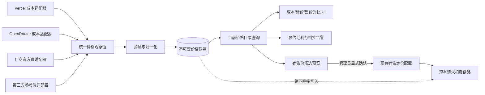

# 通用价格源目录：渠道成本、官方标价与销售定价隔离 Spec

## 文档状态

- 状态：Draft，待评审
- 日期：2026-08-28
- 适用分支基线：`downstream/main@7f7f006af8e5fdb027865d05107e93a267ece46e`
- 风险等级：S3（计费域设计；本文档本身不修改计费、数据库或生产配置）
- 首个适配器：Vercel AI Gateway `GET https://ai-gateway.vercel.sh/v1/models`
- 关联但不应直接部署的探索分支：`bowen/vercel-price-sync`

## 1. 决策摘要

New API 当前只有一套面向用户扣费的模型定价，没有渠道级成本价，也没有成本同步机制。
现有“上游价格同步”会直接修改 `ModelPrice`、`ModelRatio`、`CompletionRatio` 或
`billing_expr`，因此不能把 Vercel 折后价格直接同步进去，否则会把采购成本误当成销售标价。

本 Spec 选择建设一个供应商无关的“价格源目录”：

- 各供应商通过独立适配器提供价格观察值。
- 价格观察值明确区分“渠道成本”和“官方/参考标价”。
- 当前 New API 模型定价继续作为唯一生效的销售价。
- 自动同步只更新价格目录，绝不自动修改销售价、分组倍率或用户余额。
- Vercel 只是第一个渠道成本适配器，不在领域模型、数据库或 API 中形成 Vercel 特例。
- 从价格目录提升为销售价必须经过管理员显式选择、差异预览和确认；自动调价不属于首版。

结论：`bowen/vercel-price-sync` 中可复用的只有 Vercel 协议解析和阶梯价格归一化逻辑；其“写入现有计费配置”的设计应被本 Spec 取代。

## 2. 背景与当前问题

### 2.1 业务场景

同一模型至少存在三种不同价格：

1. 渠道成本：站点实际向 Vercel、OpenRouter 或其他供应商支付的价格。
2. 官方标价：模型厂商公开发布的建议售价或标准 API 价格。
3. 销售价格：New API 对用户实际扣费的价格，可再叠加用户/令牌分组倍率。

典型关系如下：

```text
Vercel 折后成本 C = 8
模型官方标价 L = 10
New API 普通用户倍率 G = 1.0

用户售价 S = L × G = 10
毛利额       = S - C = 2
毛利率       = (S - C) / S = 20%
```

如果把 Vercel 的 `8` 直接同步到 New API 模型定价，普通用户倍率为 `1.0` 时，用户也只支付 `8`，成本和售价被错误合并。

### 2.2 当前代码事实

- `model.Channel` 有余额、已用额度、模型和分组等字段，但没有按模型记录单位成本。
- `model.Pricing` 只有按统一模型保存的用户计费价格，没有 `channel_id` 维度。
- `ratio_setting` 和 `billing_setting` 是请求扣费的在线配置。
- 现有上游价格同步把所选来源直接合并回上述在线配置。
- 分组倍率可以在销售价基础上打折或加价，但不能充当独立成本账。
- 同一统一模型可以路由到多个成本不同的渠道，单一模型价格无法表达这些渠道成本差异。

### 2.3 根因

当前“上游价格同步”隐含假设是：上游返回价格等于本站希望采用的用户计费价格。
该假设对官方标价导入可能成立，但对渠道折扣价、代理采购价、区域价、服务等级价和合同价不成立。

真正缺少的不是一个 Vercel endpoint parser，而是“价格来源、价格角色和生效销售价”之间的边界。

## 3. 目标与非目标

### 3.1 目标

- 建立供应商无关的价格源和不可变价格快照模型。
- 同时支持渠道成本、厂商官方标价和第三方参考价。
- 保留来源、适用范围、币种、单位、阶梯、抓取时间和版本证据。
- 自动抓取成本时不影响用户请求计费。
- 在管理后台并排比较成本、参考标价和当前销售价。
- 支持按渠道和统一模型计算预估毛利、最差毛利和成本倒挂。
- 允许管理员把一个参考价格显式提升为销售价候选，并复用现有计费配置作为最终生效面。
- 支持 SQLite、MySQL 5.7.8+ 和 PostgreSQL 9.6+。
- 为 Vercel AI Gateway 提供首个适配器，并为后续供应商复用同一契约。

### 3.2 非目标

- 首版不自动根据成本改动用户销售价。
- 首版不自动调整 `GroupRatio`、`GroupGroupRatio` 或充值倍率。
- 首版不承诺账务级真实利润；支付手续费、汇率损益、税费、退款和合同返利不进入毛利计算。
- 首版不为每次请求写入成本和毛利日志；请求级真实渠道毛利属于后续阶段。
- 首版不爬取没有稳定机器接口的厂商网页。
- 首版不把“官方倍率预设”名称当作厂商官方证明；每个来源必须标注真实来源类型和权威等级。
- 首版不允许任意管理员 URL 参与后台定时抓取，避免形成 SSRF 面。
- 首版不改变 relaykit 公共 API。

## 4. 核心概念与不变量

### 4.1 价格角色

`PriceRole` 只允许以下值：

- `supplier_cost`：与某个实际渠道关联的采购成本。
- `vendor_list`：模型厂商发布的官方公开标价。
- `curated_reference`：models.dev、社区预设等第三方整理价。

现有 New API 在线模型定价不进入 `PriceRole`；它被称为 `active_sale_price`，仍由现有 `ratio_setting` / `billing_setting` 管理。

### 4.2 价格适用范围

`PriceScope` 用来说明观察值代表谁能获得的价格：

- `public`：公开可见、对所有客户一致。
- `account`：与当前渠道账号相关。
- `contract`：线下合同价或人工维护的采购价。
- `regional`：特定区域价格。
- `service_tier`：特定服务等级价格。
- `unknown`：来源没有提供足够证据判断适用范围。

一个来源无法证明价格适用范围时必须标记为 `public` 或 `unknown`，不得擅自声称是账号实际结算价。

### 4.3 强制不变量

1. 价格目录写入不得修改：
   - `ModelPrice`
   - `ModelRatio`
   - `CompletionRatio`
   - `CacheRatio`
   - `CreateCacheRatio`
   - `ImageRatio`
   - `AudioRatio`
   - `AudioCompletionRatio`
   - `billing_setting.billing_mode`
   - `billing_setting.billing_expr`
   - 任意分组倍率、用户余额或渠道余额
2. 所有目录价格都是观察值，不是扣费权威。
3. 销售价变更必须是独立管理员动作，并在写前展示完整 diff。
4. 价格快照不可原地改写；同一内容通过指纹实现幂等。
5. 抓取失败或返回模型变少时保留上次成功快照，不将缺失模型解释为零成本。
6. 成本解析失败不得回退为销售价，也不得生成零价格。
7. 所有金额计算使用十进制定点语义，不使用二进制浮点作为持久化权威。
8. 来源凭证、API Key、Authorization header 和完整私有响应不得写入价格快照或普通日志。

## 5. 总体架构



### 5.1 模块建议

建议新增根模块 `service/upstreamprice/`，不放进 `relaykit/`：

```text
service/upstreamprice/
  adapter.go             通用适配器契约
  registry.go            已注册适配器与来源匹配
  normalize.go           单位、币种和表达式归一化
  validate.go            价格边界和覆盖率校验
  sync.go                预览、落库和幂等控制
  margin.go              销售价对比与预估毛利
  adapters/
    vercel_gateway.go     Vercel /v1/models 首适配器
```

对应持久化模型放在 `model/upstream_price.go`；HTTP controller 只负责鉴权、DTO 校验和调用 service，不承载供应商解析逻辑。

## 6. 统一适配器契约

### 6.1 接口草案

```go
type Adapter interface {
    Key() string
    Supports(source SourceConfig) bool
    Fetch(ctx context.Context, source SourceConfig) ([]Observation, FetchMeta, error)
}
```

`Observation` 是供应商无关的中间对象：

```go
type Observation struct {
    Role               PriceRole
    Scope              PriceScope
    Provider           string
    SourceModelName    string
    CanonicalModelName string
    Currency           string
    FormulaKind        string
    PriceExpr          string
    EffectiveAt        *time.Time
    SourceRevision     string
    Metadata           map[string]string
}
```

约束：

- `PriceExpr` 只表示价格观察值；不得写入 `billing_setting`。
- 表达式变量与现有 billing expression 对齐，例如 `p`、`c`、`cr` 和 `len`，以便准确表示长上下文阶梯。
- flat token price 也归一化为单档表达式，避免另建一套计算引擎。
- 每个适配器必须声明来源角色和适用范围，不能仅返回数字。
- provider-specific 字段保留在受控 metadata 中，不进入核心计费公式。

`FormulaKind` 首版支持：

- `token_expr_v1`：系数单位为 USD / 1M tokens；表达式运行结果除以 1,000,000 后得到 USD。
- `per_call_v1`：表达式结果直接表示单次请求 USD 成本，不再除以 1,000,000。

不同 `FormulaKind` 之间不得直接比较。未来媒体、时长或供应商自定义单位必须新增显式版本，不能复用一个含义模糊的 `price` 数字。

### 6.2 Vercel 首适配器

Vercel adapter 必须：

- 只匹配精确主机 `ai-gateway.vercel.sh`，拒绝后缀伪造域名。
- 使用固定 canonical endpoint `https://ai-gateway.vercel.sh/v1/models`。
- 解析 input、output、cache read 和长上下文 tiers。
- 将两档且阈值一致的价格转成可审计表达式。
- 对不一致、重叠或无法封闭覆盖的 tiers fail closed。
- 不把 `service_tiers`、`regional`、`fast` 或 cache write 猜测成默认成本。
- 为未支持的价格维度生成 warning，不静默丢失后声称完整。
- 把来源标记为 `supplier_cost`；其 `scope` 以接口实际证明为准，首版默认 `public`，除非有账号级证据。
- 不需要也不得发送渠道 API Key，因为当前 endpoint 是公开模型目录。

### 6.3 后续适配器

后续供应商必须复用相同契约，不能在 controller 中继续堆叠 URL 特判。候选顺序：

1. OpenRouter：渠道成本或公开路由价格。
2. 厂商官方机器可读价：`vendor_list`。
3. models.dev：`curated_reference`，不能标成厂商官方。
4. 人工合同价：`supplier_cost + contract`，必须有独立权限和审计。

## 7. 数据模型

### 7.1 PriceSource

价格来源注册表，用于区分真实渠道和虚拟参考源。

| 字段 | 类型建议 | 说明 |
| --- | --- | --- |
| `id` | int | GORM 主键 |
| `name` | varchar(128) | 管理员可读名称 |
| `adapter_key` | varchar(64) | 已注册适配器标识 |
| `role` | varchar(32) | `supplier_cost` / `vendor_list` / `curated_reference` |
| `scope` | varchar(32) | public/account/contract/regional/service_tier/unknown |
| `channel_id` | nullable int | 成本来源关联渠道；参考源为空 |
| `enabled` | bool | 是否允许手动同步 |
| `schedule_enabled` | bool | 是否允许后台定时同步，默认 false |
| `schedule_interval_seconds` | bigint | 最小值受后端约束 |
| `settings` | text | 非秘密 JSON 配置 |
| `last_success_at` | nullable bigint | 最近成功时间 |
| `last_error_at` | nullable bigint | 最近失败时间 |
| `last_error_summary` | varchar(255) | 脱敏摘要，不保存响应正文 |
| `created_time` | bigint | 创建时间 |
| `updated_time` | bigint | 更新时间 |

数据库约束：

- `channel_id` 使用普通索引，不依赖数据库特有 partial index。
- `settings` 使用 TEXT，由 `common.Marshal` / `common.Unmarshal` 管理。
- secret 只引用现有渠道凭证，不复制进 `settings`。
- 删除渠道时默认禁用来源并保留历史快照，不级联删除审计证据。

### 7.2 PriceSnapshot

不可变价格观察快照。

| 字段 | 类型建议 | 说明 |
| --- | --- | --- |
| `id` | int | GORM 主键 |
| `source_id` | int | PriceSource ID |
| `source_model_name` | varchar(255) | 来源原始模型名 |
| `canonical_model_name` | varchar(255) | 同步时解析出的统一模型名 |
| `currency` | varchar(8) | 首版仅允许 USD |
| `formula_kind` | varchar(32) | token_expr_v1/per_call_v1 |
| `price_expr` | text | 归一化价格表达式 |
| `expr_version` | varchar(32) | 表达式版本 |
| `effective_at` | nullable bigint | 来源明确给出的生效时间 |
| `fetched_at` | bigint | 本次抓取时间 |
| `source_revision` | varchar(128) | ETag、版本号或来源更新时间 |
| `fingerprint` | char(64) | 规范化内容 SHA-256 |
| `metadata` | text | 受控、非秘密 JSON |
| `created_time` | bigint | 入库时间 |

索引和幂等：

- 唯一键：`source_id + source_model_name + fingerprint`。
- 当前价查询索引：`source_id + canonical_model_name + fetched_at`。
- 不使用数据库 JSON 查询、partial index 或数据库特有 upsert SQL。
- 持久化前将金额规范化为十进制字符串，指纹基于 canonical JSON。
- 指纹输入必须包含 role、scope、source model、canonical model、currency、formula kind、price expression 和影响价格语义的 metadata；模型映射变化即使价格数字不变，也必须生成新快照。

### 7.3 不新增销售价表

首版不复制现有销售定价。当前售价继续由以下配置提供：

- `ModelPrice`
- `ModelRatio` 与各类 completion/cache/media ratios
- `billing_setting.billing_mode`
- `billing_setting.billing_expr`
- 分组倍率

目录查询 service 在读取时把“当前销售价”投影到对比 DTO，避免形成第二个销售价权威。

## 8. 同步语义

### 8.1 两阶段流程

每次同步分成两个明确阶段：

1. Preview
   - 抓取来源。
   - 解析并验证。
   - 展示新增、变化、缺失、无法解析和覆盖率变化。
   - 不写价格快照。
2. Commit
   - 管理员手动同步时，在确认 Preview 后写入。
   - 定时任务只允许写价格快照，不修改销售价。
   - 写入使用事务和指纹幂等。

手动 Commit 不接受客户端回传的价格内容。服务端必须重新抓取并归一化来源，只有重新计算出的结果
hash 与未过期 `preview_hash` 一致时才写入；不一致则要求重新 Preview。定时任务没有人工 Preview，
但必须执行同一组验证、覆盖率和变化阈值门禁。

### 8.2 部分失败

- 单模型格式异常：隔离该模型，其他有效观察值可以保存，同时记录 warning。
- 有效模型数为 0：整次失败，不保存。
- 相比上次成功覆盖率下降超过可配置阈值：默认拒绝 commit，标记需要人工复核。
- 来源漏掉历史模型：不删除旧快照；目录把该模型标为 stale/missing。
- HTTP 429/5xx/timeout：保留上次成功值，按现有 system task 重试策略处理。
- 币种未知、负价格、NaN、Inf、阶梯重叠或表达式 smoke test 失败：拒绝该观察值。

### 8.3 新鲜度

- 当前价是该来源/模型最近一次成功且未失效的快照。
- stale 阈值默认为同步周期的 2 倍；手工来源使用显式阈值。
- stale 价格仍可展示，但不得被标记为“当前已确认成本”。
- UI 必须同时显示 `fetched_at`、`effective_at` 和来源名称。

### 8.4 调度

- 复用现有 `SystemTask` 调度与 lease，不再新增独立 goroutine 调度器。
- 新任务类型建议为 `upstream_price_sync`。
- 默认关闭定时同步；管理员逐来源开启。
- 首版最短间隔建议为 6 小时，避免公共价格接口限流。
- 单次任务按来源串行或有限并发执行，设置总超时和单来源超时。
- 调度任务没有任何销售价写权限路径。

## 9. 销售价与成本的关系

### 9.1 用户扣费公式保持不变

```text
当前销售基础价 B = 现有模型定价或 billing_expr
实际用户扣费 S = B × 生效分组倍率 G × 已有请求倍率
```

价格目录不进入在线扣费热路径。

### 9.2 目录毛利公式

对于能够在同一请求向量下计算的价格表达式：

```text
销售额 S = Evaluate(active_sale_expr, usage) × group_ratio
渠道成本 C = Evaluate(channel_cost_expr, usage)
预估毛利额 = S - C
预估毛利率 = (S - C) / S
```

边界：

- `S = 0` 时毛利率为空，不显示无穷值。
- 一个模型存在多个可路由渠道时，同时展示最低、最高和最差成本毛利。
- 没有实际路由命中信息时只能称为“预估毛利”，不能称为真实利润。
- 参考标价不参与成本毛利；它用于比较销售策略。
- 汇率、充值折扣、支付手续费、税和退款不在首版计算范围内。

### 9.3 从目录提升为销售价

管理员可以选择一个 `vendor_list` 或 `curated_reference` 快照作为销售价候选。该动作必须：

1. 显示来源权威等级和新鲜度。
2. 显示当前销售价与候选价的逐字段/逐阶梯 diff。
3. 显示受影响模型、分组和估算价格。
4. 对 ratio、fixed price 和 tiered expression 类型转换进行冲突确认。
5. 通过服务端原子销售配置 apply 契约写入现有 option 权威。
6. 写后重新读取销售配置并记录审计信息。

Phase 3 实施时不能照搬当前前端逐个 option 顺序写入的非原子流程。模型计费类型转换可能同时涉及
多个 ratio map、billing mode 和 billing expression，必须新增服务端原子 apply/CAS 契约，或在任何失败时
用已锁定的写前快照完整回滚并验证；部分写入不能被报告为成功。

`supplier_cost` 默认不能直接批量提升为销售价；若管理员显式选择，UI 必须二次提示“这是渠道成本，不是官方标价”。

## 10. 管理 API 草案

所有接口仅管理员可用。命名可在实现评审时调整，但职责必须保持分离。

### 10.1 来源管理

```text
GET    /api/upstream-price-sources
POST   /api/upstream-price-sources
PUT    /api/upstream-price-sources/:id
```

首版不提供硬删除；使用 `enabled=false`。

### 10.2 同步

```text
POST /api/upstream-price-sources/:id/preview
POST /api/upstream-price-sources/:id/sync
```

`sync` 请求必须携带 preview 返回的短期 `preview_hash`，防止确认后来源内容已变化。

### 10.3 查询与比较

```text
GET /api/upstream-prices/current
GET /api/upstream-prices/history
POST /api/upstream-prices/compare
```

`compare` 接收模型、分组和 usage vector，返回各渠道成本、当前售价和预估毛利，不写状态。

### 10.4 销售价候选

```text
POST /api/upstream-prices/sale-candidate
```

该接口只生成现有销售配置的变更预览。真正应用继续走现有系统 option 更新入口，并保留现有冲突确认。

## 11. 管理界面

现有“上游价格同步”应拆成两个明确入口：

### 11.1 价格源目录

用于抓取和管理观察值：

- 来源名称、角色、范围和关联渠道。
- 最近成功/失败时间、新鲜度和覆盖模型数。
- 手动 Preview、同步和调度开关。
- 不出现“直接应用为售价”的默认批量按钮。

### 11.2 价格比较

模型级展示：

- 当前销售基础价。
- 厂商官方标价。
- 第三方参考价。
- 各渠道当前成本。
- 最低/最高成本、普通分组预估售价和最差毛利。
- stale、来源冲突、成本倒挂和缺失价格状态。

### 11.3 销售价管理

仍以现有“模型定价”为权威，只新增“从价格目录选择候选”的入口。用户必须明确选择来源和字段，不默认全选成本来源。

## 12. 安全与权限

- 所有来源管理、同步、成本查询和毛利查询接口要求系统管理员权限。
- 普通用户定价 API 不暴露渠道成本、合同价、来源账号或毛利。
- `supplier_cost` 永远不进入公开 `/api/pricing` 或 ratio API。
- 后台定时抓取只允许已注册 adapter 的 canonical endpoint。
- 不允许从 PriceSource settings 提供任意 scheme/host。
- 对确需认证的未来 adapter，只从现有安全渠道配置读取凭证，不在 DTO、数据库快照或日志中复制。
- HTTP 错误只记录状态、adapter、source ID 和脱敏摘要。
- Preview hash 必须绑定 source ID、规范化结果和过期时间。
- 成本数据属于管理员敏感运营信息，审计日志中的明细应放在 `admin_info` 下。

## 13. 可观测性与告警

每次同步至少记录：

- source ID、adapter key 和 run ID。
- 抓取耗时、HTTP 状态和响应大小。
- 发现模型数、有效数、跳过数、变化数和覆盖率。
- 新增快照数和幂等命中数。
- stale 数、无法映射模型数和解析 warning 分类。
- preview hash 和 commit hash，不记录价格源凭证。

建议告警：

- 来源连续 3 次同步失败。
- 成本来源超过 stale 阈值。
- 模型覆盖率下降超过阈值。
- 任一普通销售分组出现成本倒挂。
- 单次价格变化超过管理员配置的百分比阈值。

## 14. 数据保留

- 当前快照长期保留。
- 历史快照首版默认保留 180 天，保留策略由后台任务按明确 manifest 清理。
- 合同价来源可配置更长保留期。
- 清理只删除已经被更新快照覆盖且超过保留期的历史记录，不删除来源、当前快照或审计记录。
- 实施清理前需单独设计跨数据库安全删除与批次边界；不属于首版同步 PR。

## 15. 迁移与兼容性

### 15.1 数据库

- 新表通过 GORM `AutoMigrate` 纳入 SQLite、MySQL 和 PostgreSQL。
- 不修改现有 option 键，不回填历史销售价为成本。
- 不从现有模型价格推断渠道成本，因为无法证明来源和折扣。
- 新表为空时，所有现有计费、路由和定价展示行为保持不变。

### 15.2 现有上游价格同步

- 厂商官方或 curated reference 的“销售价候选”能力可逐步迁移到新目录。
- 迁移完成前，现有同步入口保留，但必须在 UI 上明确其会修改用户计费价。
- Vercel `supplier_cost` 不接入旧的 Apply Sync 路径。
- 最终移除 controller 中不断增加供应商 URL 特判的模式，改由 adapter registry 负责。

### 15.3 探索分支处理

`bowen/vercel-price-sync` 不合并、不部署。后续实现可以择取：

- Vercel endpoint 精确匹配。
- Vercel payload DTO。
- flat/tiered 价格归一化。
- 恶意 host、异常 tier 和长上下文表达式测试向量。

不应择取：

- 将 Vercel 结果写入 `ModelRatio` / `billing_expr` 的路径。
- 把 Vercel host 特判长期留在通用 ratio sync controller。
- 将 Vercel 成本默认展示为用户销售价。

## 16. 方案比较与裁决

### 16.1 直接把 Vercel 价格同步为模型定价

拒绝。实现成本最低，但会把折后成本当成用户售价；下一次同步还会覆盖人工销售策略。

### 16.2 用统一分组倍率把 Vercel 成本还原成官方价

拒绝。只有所有模型、输入、输出、缓存和阶梯都使用同一折扣时才成立。实际折扣通常按模型和价格维度变化，统一倍率会产生不可见误差。

### 16.3 只新增 Vercel 成本表

拒绝。它会建立供应商特例，后续每增加一个渠道都要复制数据库字段、API 和 UI，无法形成可复用能力。

### 16.4 一次建设完整财务利润系统

延后。账务级利润需要订单收入、充值折扣、支付手续费、退款、税、汇率和实际供应商账单，范围远超价格同步。本 Spec 只建立可审计的价格来源和预估毛利基础。

### 16.5 通用价格源目录

选择。它增强现有销售定价主干，不建立第二套在线扣费系统；一个来源契约同时服务渠道成本、厂商标价和第三方参考价，并允许 Vercel 作为首个适配器验证设计。

## 17. 分阶段交付

### Phase 0：Spec 与来源验证

- 评审本 Spec。
- 用 Vercel 当前响应验证归一化契约。
- 确认 Vercel 公开价格的真实 scope，是 public gateway price 还是账号实际结算价。
- 确认首版需要展示的官方标价来源；没有权威机器源时允许人工销售价继续作为权威。

### Phase 1：只读价格目录

- PriceSource / PriceSnapshot 模型和跨数据库迁移。
- adapter registry 和 Vercel 首适配器。
- 手动 Preview / Sync。
- 当前成本查询和新鲜度状态。
- 不接入销售配置，不启用定时任务。

### Phase 2：比较与安全调度

- 管理后台价格源目录和价格比较页面。
- 复用 SystemTask 的定时同步，默认关闭。
- 成本倒挂和覆盖率告警。
- vendor list / curated reference 适配器。

### Phase 3：显式销售价候选

- 从 vendor list / curated reference 生成销售价 diff。
- 管理员确认后写入现有销售配置。
- 销售价写后 readback 和审计。
- supplier cost 的二次风险提示。

### Phase 4：请求级毛利（独立立项）

- 按实际命中 channel 和 usage 评估请求成本。
- 在管理员日志保存成本快照指纹、销售额和预估毛利。
- 处理退款、异步任务结算、缓存、媒体单位和多阶段扣费。
- 评估是否需要账务级成本与财务对账，不与目录首版混合。

## 18. 测试策略

### 18.1 单元测试

- adapter host 和 endpoint 精确匹配。
- 金额单位、十进制字符串和 canonical fingerprint。
- flat、长上下文、cache read、per-call 表达式。
- tier 缺失、重叠、阈值不一致和负数/NaN/Inf 拒绝。
- model mapping 前后名称同时保留。
- stale 和覆盖率下降判断。
- 毛利计算的零售价、成本倒挂和多渠道最差值。

### 18.2 持久化测试

- SQLite 实际 AutoMigrate、插入、幂等和 latest 查询。
- MySQL/PostgreSQL SQL 生成或配置环境契约测试。
- 同一快照重复同步不新增记录。
- 来源禁用后历史快照仍可查询。
- 渠道删除/禁用不级联删除快照。

### 18.3 计费隔离回归

在同步前后分别保存并比较以下配置，要求逐字节相同：

- model price/ratio maps
- billing mode/expression maps
- group ratios
- user quota
- channel balance

同时验证：

- 请求计费结果不因价格目录存在而改变。
- 普通 `/api/pricing` 不返回成本字段。
- 非管理员无法访问成本 API。

### 18.4 端到端测试

- Vercel Preview 展示新增和变化但不落库。
- Vercel Sync 只新增快照。
- 定时任务关闭时不自动创建 sync run。
- stale 来源和成本倒挂在 UI 明确标识。
- 选择官方参考价生成销售价候选时，应用前必须确认；取消不写入。

## 19. 上线与回滚

### 19.1 上线门禁

1. 独立 worktree 和 Draft PR。
2. 数据库迁移在 SQLite、MySQL、PostgreSQL 验证。
3. backend、frontend、跨模块和计费隔离测试通过。
4. staging 只启用手动 Vercel Preview。
5. staging 手动 Sync 后确认在线用户计费配置 raw diff 为零。
6. 生产迁移、部署和首次来源创建分别获得明确授权。
7. 生产首次只 Preview；保存前回读来源数量和模型覆盖率。
8. 首次 Commit 后再次回读销售配置、用户余额和渠道余额无变化。
9. 定时同步保持关闭，另行授权后再灰度开启。

### 19.2 失败阈值

任一条件触发即停止扩展：

- 销售配置出现非预期 diff。
- 任何用户请求计费结果改变。
- Vercel 有效模型数为零或覆盖率异常下降。
- 出现凭证、响应正文或成本数据对普通用户泄漏。
- 三种数据库任一迁移或唯一键行为不一致。
- 定时任务发生重叠执行、失去 lease 或不可控重试。

### 19.3 回滚

- 关闭所有 PriceSource 和调度开关。
- 隐藏管理 UI 入口。
- 保留新表和快照供审计，不需要回写销售配置。
- 代码回滚不依赖删除价格快照。
- 若未来销售价候选功能已应用，销售配置回滚必须使用应用前保存的精确 option 快照，不能通过成本目录反推。

## 20. 验收标准

首版完成需同时满足：

- [ ] Vercel 作为 adapter，而不是 controller 中的业务特例。
- [ ] PriceSource 和 PriceSnapshot 不包含供应商专属字段。
- [ ] Vercel flat 与长上下文价格能归一化并保留来源证据。
- [ ] 手动/自动成本同步均不修改任何销售计费配置。
- [ ] 普通用户和公开 pricing API 看不到成本。
- [ ] 管理员能看到成本、当前售价、新鲜度和最差预估毛利。
- [ ] 多渠道同模型可以保留不同成本。
- [ ] 来源失败、缺失模型和 stale 均 fail closed。
- [ ] SQLite、MySQL、PostgreSQL 行为一致。
- [ ] 定时同步默认关闭，并复用 SystemTask lease。
- [ ] `bowen/vercel-price-sync` 未被直接合并或部署。

## 21. 待确认问题

以下问题会影响实现，但不改变“成本与售价分离”的结论：

1. Vercel `/v1/models` 返回的是公开 gateway 价格，还是当前账号最终结算价格？若只是公开价格，`scope` 必须是 `public`，不能称为实际采购成本。
2. 哪个来源被认可为厂商官方标价？当前“官方倍率预设”实际来自 basellm GitHub，models.dev 也是 curated reference，不应仅凭 UI 名称当作官方。
3. 首版是否需要人工合同价来源，还是只支持机器接口？
4. 销售价比较默认使用哪个分组：`default`，还是管理员可选择的分组？
5. 历史价格保留期和成本信息的管理员可见范围是否需要进一步收紧？
6. 成本倒挂告警只在后台展示，还是需要接入现有通知渠道？

在上述问题得到确认前，可以实施 Phase 1 的只读价格目录，但不能启用“自动销售价更新”或宣称已经具备真实财务毛利。
