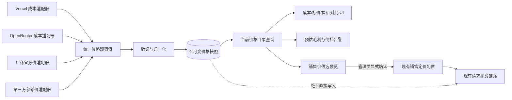

# 通用价格源目录：渠道成本、官方标价与销售定价隔离 Spec

## 文档状态

- 状态：Draft rev5，Phase 1 已实施并合并；Phase 2 后端（投影 API、比较接口、定时同步、告警、curated reference 适配器）已实施，Phase 2 前端未开始
- 日期：2026-08-28
- 适用分支基线：`downstream/main@7f7f006af8e5fdb027865d05107e93a267ece46e`
- 风险等级：S3（计费域设计；本文档本身不修改计费、数据库或生产配置）
- 首个适配器：Vercel AI Gateway `GET https://ai-gateway.vercel.sh/v1/models`
- 关联但不应直接部署的探索分支：`bowen/vercel-price-sync`

## 1. 决策摘要

New API 当前只有一套面向用户扣费的模型定价，没有渠道级成本价，也没有成本同步机制。
现有“上游价格同步”会直接修改 `ModelPrice`、`ModelRatio`、`CompletionRatio` 或
`billing_expr`，因此不能把 Vercel 折后价格直接同步进去，否则会把采购成本误当成销售标价。

本 Spec 选择建设一个供应商无关的“价格源目录”：

- 各供应商通过独立适配器提供价格观察值。
- 价格观察值明确区分“渠道成本”和“官方/参考标价”。
- 当前 New API 模型定价继续作为唯一生效的销售价。
- 自动同步只更新价格目录，绝不自动修改销售价、分组倍率或用户余额。
- Vercel 只是第一个渠道成本适配器，不在领域模型、数据库或 API 中形成 Vercel 特例。
- 从价格目录提升为销售价必须经过管理员显式选择、差异预览和确认；自动调价不属于首版。

结论：`bowen/vercel-price-sync` 中可复用的只有 Vercel 协议解析和阶梯价格归一化逻辑；其“写入现有计费配置”的设计应被本 Spec 取代。

## 2. 背景与当前问题

### 2.1 业务场景

同一模型至少存在三种不同价格：

1. 渠道成本：站点实际向 Vercel、OpenRouter 或其他供应商支付的价格。
2. 官方标价：模型厂商公开发布的建议售价或标准 API 价格。
3. 销售价格：New API 对用户实际扣费的价格，可再叠加用户/令牌分组倍率。

典型关系如下：

```text
Vercel 折后成本 C = 8
模型官方标价 L = 10
New API 普通用户倍率 G = 1.0

用户售价 S = L × G = 10
毛利额       = S - C = 2
毛利率       = (S - C) / S = 20%
```

如果把 Vercel 的 `8` 直接同步到 New API 模型定价，普通用户倍率为 `1.0` 时，用户也只支付 `8`，成本和售价被错误合并。

价格口径实证（2026-08-28 实测）：`GET https://ai-gateway.vercel.sh/v1/models` 无鉴权返回 HTTP 200。
与 models.dev 收录的厂商标价对比，`openai/gpt-5.6-sol` Vercel 报价 $2/$10（input/output，每 1M tokens），
厂商标价为 $4/$20，即 Vercel 五折，且该模型带 `varies_by_provider: true`；`openai/gpt-5.6-luna` 与
`openai/gpt-5.6-terra` 两边一致。这证明 Vercel `/v1/models` 返回的是 gateway 对所有客户统一的实际
收费价（含 Vercel 自身促销折扣），不是厂商标价。站点管理员已确认其 Vercel 账号按公开目录价结算、
无账号级折扣，因此该来源可作为真实渠道成本参与毛利计算，`scope = public` 成立。上方 C=8 / L=10
为示意数字；sol 的 2 对 4 即该关系的真实实例。

### 2.2 当前代码事实

- `model.Channel` 有余额、已用额度、模型和分组等字段，但没有按模型记录单位成本。
- `model.Pricing` 只有按统一模型保存的用户计费价格，没有 `channel_id` 维度。
- `ratio_setting` 和 `billing_setting` 是请求扣费的在线配置。
- 现有上游价格同步把所选来源直接合并回上述在线配置。
- 分组倍率可以在销售价基础上打折或加价，但不能充当独立成本账。
- 同一统一模型可以路由到多个成本不同的渠道，单一模型价格无法表达这些渠道成本差异。

### 2.3 根因

当前“上游价格同步”隐含假设是：上游返回价格等于本站希望采用的用户计费价格。
该假设对官方标价导入可能成立，但对渠道折扣价、代理采购价、区域价、服务等级价和合同价不成立。

真正缺少的不是一个 Vercel endpoint parser，而是“价格来源、价格角色和生效销售价”之间的边界。

## 3. 目标与非目标

### 3.1 目标

- 建立供应商无关的价格源和不可变价格快照模型。
- 同时支持渠道成本、厂商官方标价和第三方参考价。
- 保留来源、适用范围、币种、单位、阶梯、抓取时间和版本证据。
- 自动抓取成本时不影响用户请求计费。
- 在管理后台并排比较成本、参考标价和当前销售价。
- 支持按渠道和统一模型计算预估毛利、最差毛利和成本倒挂。
- 允许管理员把一个参考价格显式提升为销售价候选，并复用现有计费配置作为最终生效面。
- 支持 SQLite、MySQL 5.7.8+ 和 PostgreSQL 9.6+。
- 为 Vercel AI Gateway 提供首个适配器，并为后续供应商复用同一契约。

### 3.2 非目标

- 首版不自动根据成本改动用户销售价。
- 首版不自动调整 `GroupRatio`、`GroupGroupRatio` 或充值倍率。
- 首版不承诺账务级真实利润；支付手续费、汇率损益、税费、退款和合同返利不进入毛利计算。
- 首版不为每次请求写入成本和毛利日志；请求级真实渠道毛利属于后续阶段。
- 首版不爬取没有稳定机器接口的厂商网页。
- 首版不把“官方倍率预设”名称当作厂商官方证明；每个来源必须标注真实来源类型和权威等级。
- 首版不允许任意管理员 URL 参与后台定时抓取，避免形成 SSRF 面。
- 首版不改变 relaykit 公共 API。

## 4. 核心概念与不变量

### 4.1 价格角色

`PriceRole` 只允许以下值：

- `supplier_cost`：与某个实际渠道关联的采购成本。
- `vendor_list`：模型厂商发布的官方公开标价。
- `curated_reference`：models.dev、社区预设等第三方整理价。

现有 New API 在线模型定价不进入 `PriceRole`；它被称为 `active_sale_price`，仍由现有 `ratio_setting` / `billing_setting` 管理。

### 4.2 价格适用范围

`PriceScope` 用来说明观察值代表谁能获得的价格：

- `public`：公开可见、对所有客户一致。
- `account`：与当前渠道账号相关。
- `contract`：线下合同价或人工维护的采购价。
- `regional`：特定区域价格。
- `service_tier`：特定服务等级价格。
- `unknown`：来源没有提供足够证据判断适用范围。

一个来源无法证明价格适用范围时一律标记为 `unknown`，不得擅自声称是账号实际结算价。`public` 必须有公开可访问且对所有客户一致的证据；Vercel 首源满足该证据要求（见 §2.1）。

### 4.3 强制不变量

1. 价格目录写入不得修改：
   - `ModelPrice`
   - `ModelRatio`
   - `CompletionRatio`
   - `CacheRatio`
   - `CreateCacheRatio`
   - `ImageRatio`
   - `AudioRatio`
   - `AudioCompletionRatio`
   - `billing_setting.billing_mode`
   - `billing_setting.billing_expr`
   - 任意分组倍率、用户余额或渠道余额
2. 所有目录价格都是观察值，不是扣费权威。
3. 销售价变更必须是独立管理员动作，并在写前展示完整 diff。
4. 价格快照的价格内容不可原地改写；同一内容通过指纹实现幂等。幂等命中时仅允许更新观察证据字段 `last_seen_at` 与 `last_seen_run_id`，其余字段一律不可变。
5. 抓取失败或返回模型变少时保留上次成功快照，不将缺失模型解释为零成本。
6. 成本解析失败不得回退为销售价，也不得生成零价格。
7. 来源解析、归一化、持久化与指纹使用十进制字符串；表达式求值（含毛利展示计算）使用有界 float64，必须拒绝 NaN/Inf 并做边界检查；不声称全链路定点。
8. 来源凭证、API Key、Authorization header 和完整私有响应不得写入价格快照或普通日志。

## 5. 总体架构



### 5.1 模块建议

建议新增根模块 `service/upstreamprice/`，不放进 `relaykit/`：

```text
service/upstreamprice/
  adapter.go             通用适配器契约
  registry.go            已注册适配器与来源匹配
  normalize.go           单位、币种和表达式归一化
  validate.go            价格边界和覆盖率校验
  sync.go                预览、落库和幂等控制
  margin.go              销售价对比与预估毛利
  adapters/
    vercel_gateway.go     Vercel /v1/models 首适配器
```

对应持久化模型放在 `model/upstream_price.go`；HTTP controller 只负责鉴权、DTO 校验和调用 service，不承载供应商解析逻辑。请求/响应 DTO 放在根模块 `dto/`，不进入 `relaykit/dto`（relaykit 公共 API 保持不变的承诺见 §3.2）。

## 6. 统一适配器契约

### 6.1 接口草案

```go
type Adapter interface {
    Key() string
    Supports(source SourceConfig) bool
    Fetch(ctx context.Context, source SourceConfig) ([]Observation, FetchMeta, error)
    AllowedRoles() []PriceRole
    AllowedScopes() []PriceScope
}
```

`Supports` 只回答适配器身份问题（这个来源是否由本适配器服务）。role 与渠道的组合规则不在适配器里重复判定，
唯一权威是 `ValidatePriceSourceForWrite`（§7.1）：`supplier_cost` 必须引用一个 enabled 渠道，其余 role 一律禁止渠道。
适配器不得声明自己的渠道要求，否则同一规则会出现第二个可漂移的判定源。

**可选能力接口。** 适配器的附加能力用独立的小接口表达，`Adapter` 主接口不做强制：

```go
// 固定公开 URL 的适配器实现；没有固定 URL 的适配器不实现该接口，
// 而不是实现后返回空串。
type EndpointReporter interface {
    Endpoint() string
}
```

`ListAdapters` 用类型断言取值，未实现者的 `endpoint` 为空串。后续新增的可选能力沿用同一写法，例如条件请求：

```go
// 上游支持 HTTP 条件请求的适配器实现；ifNoneMatch 是基线 run 的 source_revision。
// 上游回 304 时返回空 observations 与 FetchMeta.NotModified，不读、不解析 body。
type ConditionalFetcher interface {
    FetchConditional(ctx context.Context, source SourceConfig, ifNoneMatch string) ([]Observation, FetchMeta, error)
}
```

`Fetch` 签名不变；同步引擎用类型断言选择路径，未实现该接口的适配器行为完全不变。
`FetchMeta.NotModified` 只对引擎自己发出的条件请求生效，且只允许由真实 304 应答置位。

`ifNoneMatch` 由适配器负责按 HTTP 语义使用：不是合法 entity-tag 的 revision（例如被列宽截断的值）必须
退化为无条件请求，而不是把畸形头发到线上。

`Observation` 是供应商无关的中间对象：

```go
type Observation struct {
    Role               PriceRole
    Scope              PriceScope
    Provider           string
    SourceModelName    string
    CanonicalModelName string
    Currency           string
    FormulaKind        string
    PriceExpr          string
    EffectiveAt        *time.Time
    Metadata           map[string]string
}
```

`FetchMeta` 携带来源级抓取证据（ETag、版本号或来源更新时间），持久化到 `PriceSyncRun.source_revision`（见 §7.3），不再逐快照保存。

约束：

- `PriceExpr` 只表示价格观察值；不得写入 `billing_setting`。
- 表达式变量与现有 billing expression 对齐，例如 `p`、`c`、`cr` 和 `len`，以便准确表示长上下文阶梯。
- flat token price 也归一化为单档表达式，避免另建一套计算引擎。
- 每个适配器必须声明其允许的 role/scope 集合，不能仅返回数字。role/scope 取值算法唯一：Observation 未给值时取 PriceSource 的默认声明；给了值但超出 adapter 或来源允许范围时拒绝该 observation（run item 计为 rejected），禁止静默覆盖。
- provider-specific 字段保留在受控 metadata 中，不进入核心计费公式。

`FormulaKind` 首版支持：

- `token_expr_v1`：系数单位为 USD / 1M tokens；表达式运行结果除以 1,000,000 后得到 USD。
- `per_call_v1`：表达式结果直接表示单次请求 USD 成本，不再除以 1,000,000。

不同 `FormulaKind` 之间在系数与表达式层面不得直接比较；在同一 usage vector 下求值为同币种金额后可以且必须可比（例如按次销售价与 token 成本之间的毛利比较，见 §9.3）。未来媒体、时长或供应商自定义单位必须新增显式版本，不能复用一个含义模糊的 `price` 数字。

### 6.2 Vercel 首适配器

实测（2026-08-28）该 endpoint 返回约 358 个模型，pricing 对象出现过约 24 种键（以实测为准），
价格为十进制字符串（USD/token）。除 `input`、`output`、`input_cache_read`、`input_cache_write`
及对应 `*_tiers` 外，还有 `fast`、`service_tiers`、`regional`、`peak_pricing`、`varies_by_provider`、
`web_search`、`image`、`image_dimension_quality_pricing`、`audio_input_token_cost`、
`audio_output_token_cost`、`speech_input_character_cost`、`transcription_duration_cost_per_second`、
`realtime_client_message_cost`、`realtime_session_duration_cost_per_second`、`maps_search`、
`video_duration_pricing`、`video_token_pricing` 等场景专属维度。首版仅归一化 input、output、
cache read、cache write 的 flat 价格与长上下文 tiers。

Vercel adapter 必须：

- 只匹配精确主机 `ai-gateway.vercel.sh`，拒绝后缀伪造域名。
- 使用固定 canonical endpoint `https://ai-gateway.vercel.sh/v1/models`。
- 解析 input、output、cache read、cache write 的 flat 价格与长上下文 tiers。
- 将两档且阈值一致的价格转成可审计表达式。
- tier 边界按半开区间 `[min, max)` 解释：`min` 含、`max` 不含。例如 `{"cost":"0.000003","min":0,"max":200001}` 与 `{"cost":"0.000006","min":200001}` 归一化为 `len <= 200000` 的两档表达式。该开闭语义必须有对应测试向量。
- 对不一致、重叠或无法封闭覆盖的 tiers fail closed。
- 带 `varies_by_provider: true` 的模型：观察值仍保存，但必须在 metadata 打标，并在目录查询和 UI 强制展示“多 provider 价格不一，成本不确定”，不得标为“当前已确认成本”。
- 不把 `peak_pricing`、`service_tiers`、`regional`、`fast`、`web_search` 或 image/audio/video 专属维度猜测成默认成本；为这些未支持的价格维度生成 warning，不静默丢失后声称完整。
- 覆盖率统计必须把“无法归一化（unsupported）”与“来源缺失（missing）”分开计数，避免 unsupported warning 淹没真实缺失。
- 把来源标记为 `supplier_cost`；`scope` 为 `public`（实证与管理员确认见 §2.1）。
- 不需要也不得发送渠道 API Key，因为当前 endpoint 是公开模型目录。
- 抓取 HTTP client 必须禁止重定向（`CheckRedirect` 直接拒绝）、设置连接/响应/总超时，并对响应体按解压后大小设最大字节数上限，超限显式失败。
- 不得复用现有 ratio_sync 的 HTTP client 构建模式（其未设置 `CheckRedirect`）。

### 6.3 后续适配器

后续供应商必须复用相同契约，不能在 controller 中继续堆叠 URL 特判。候选顺序：

1. OpenRouter：渠道成本或公开路由价格。
2. 厂商官方机器可读价：`vendor_list`。首版不做，待有厂商官方机器可读源再立项。
3. basellm / models.dev：`curated_reference`，不能标成厂商官方；UI 必须标注非官方。Phase 2 接入。
   实施结论（Phase 2 实测）：两者均有稳定、免鉴权的机器可读端点，范围未缩小。
   models.dev 为 `https://models.dev/api.json`（约 4.4 MB，带 ETag，README 中有 API 说明）；
   basellm 为 `https://basellm.github.io/llm-metadata/api/all.json`（约 0.5 MB，是 models.dev 的过滤派生集）。
   两者 payload 形状一致（provider → models → `cost`，系数单位为 USD/1M tokens），共用同一解析器。
   归一化范围限定为 `input`/`output`/`cache_read`/`cache_write` 的 flat 价格：模型 `cost` 含
   `tiers` 或 `context_over_200k` 时整条记为 unsupported（只记基础档会低报长上下文价格），
   其余未支持维度进 metadata warning，不猜测。价格按源 JSON 原文走十进制校验，指数形式一律拒绝。
   条件请求（2026-08-29 实测）：两个端点都返回强 ETag 且遵守 `If-None-Match`，内容未变时回 304。
   因此这两个适配器实现可选接口 `ConditionalFetcher`（见 §6.1 与 §8.1 的 304 语义）；上游若不再
   返回 ETag，基线 `source_revision` 为空，自动退化为全量抓取，行为与接入前一致。
4. 人工合同价：`supplier_cost + contract`，必须有独立权限和审计。不进首版，后续独立立项。

## 7. 数据模型

### 7.1 PriceSource

价格来源注册表，用于区分真实渠道和虚拟参考源。

| 字段 | 类型建议 | 说明 |
| --- | --- | --- |
| `id` | int | GORM 主键 |
| `name` | varchar(128) | 管理员可读名称 |
| `adapter_key` | varchar(64) | 已注册适配器标识 |
| `role` | varchar(32) | `supplier_cost` / `vendor_list` / `curated_reference` |
| `scope` | varchar(32) | public/account/contract/regional/service_tier/unknown |
| `channel_id` | nullable int | 成本来源关联渠道；参考源为空 |
| `enabled` | bool | 是否允许手动同步 |
| `schedule_enabled` | bool | 是否允许后台定时同步，默认 false |
| `schedule_interval_seconds` | bigint | 最小值受后端约束 |
| `settings` | text | 非秘密 JSON 配置 |
| `config_revision` | bigint | 配置修订号；每次配置修改递增 |
| `last_success_run_id` | nullable int | 最近成功（succeeded/partial）run；当前价判定权威 |
| `last_success_at` | nullable bigint | 最近成功时间（展示冗余；权威为 `last_success_run_id`） |
| `last_error_at` | nullable bigint | 最近失败时间 |
| `last_error_summary` | varchar(255) | 脱敏摘要，不保存响应正文 |
| `created_time` | bigint | 创建时间 |
| `updated_time` | bigint | 更新时间 |

数据库约束：

- `channel_id` 使用普通索引，不依赖数据库特有 partial index。
- `settings` 使用 TEXT，由 `common.Marshal` / `common.Unmarshal` 管理，按严格白名单解析（未知键一律拒绝，不静默忽略）。当前白名单为 `model_mappings`（§7.5）、`coverage_drop_threshold`（§8.2）、`stale_threshold_seconds`（§8.3）、`price_jump_threshold`（§13）。
- secret 只引用现有渠道凭证，不复制进 `settings`。
- 角色与渠道组合约束：`supplier_cost` 来源创建/更新时必须关联一个存在且启用的 channel；`vendor_list` / `curated_reference` 不得关联 channel。MySQL 5.7 的 CHECK 约束不可靠，以 service 层校验为权威，并配行为测试。
- 渠道删除不挂钩：不修改现有渠道删除路径（单删、批量删、删除禁用渠道均直接删除 Channel，挂钩这三条路径会扩大对 upstream-owned 代码的修改面）。改为查询与调度侧 orphan 检测：关联 channel 不存在时来源标记 `orphaned`，UI 明示；orphan 来源允许 Preview（诊断用途），手动 Commit 与定时执行一律拒绝，历史快照保留。
- 来源上的 `role` / `scope` 只是“新快照的默认声明”（取值算法见 §6.1）；快照写入后其自带的 role/scope/provider/mapping_status 即历史权威，事后修改来源的 role/scope 不重新解释历史快照。

### 7.2 PriceSnapshot

不可变价格观察快照。

| 字段 | 类型建议 | 说明 |
| --- | --- | --- |
| `id` | int | GORM 主键 |
| `source_id` | int | PriceSource ID |
| `source_model_name` | varchar(255) | 来源原始模型名 |
| `canonical_model_name` | varchar(255) | 同步时解析出的统一模型名 |
| `role` | varchar(32) | 写入时的价格角色（取值算法见 §6.1）；历史权威 |
| `scope` | varchar(32) | 写入时的适用范围；历史权威 |
| `provider` | varchar(64) | 写入时解析出的 provider |
| `mapping_status` | varchar(16) | mapped_default / mapped_explicit / unmapped |
| `currency` | varchar(8) | 首版仅允许 USD |
| `formula_kind` | varchar(32) | token_expr_v1/per_call_v1 |
| `price_expr` | text | 归一化价格表达式 |
| `expr_version` | varchar(32) | 表达式版本 |
| `effective_at` | nullable bigint | 来源明确给出的生效时间 |
| `fetched_at` | bigint | 首次抓取到该内容的时间 |
| `last_seen_at` | bigint | 最近一次观察到该内容的时间；幂等命中时更新（观察证据，非当前价权威） |
| `last_seen_run_id` | int | 最近一次观察到该内容的 run；幂等命中时更新 |
| `fingerprint` | char(64) | 规范化内容 SHA-256 |
| `fingerprint_version` | varchar(16) | 指纹算法与 canonical payload 版本；进入 canonical payload。归一化语义（canonical payload 布局、映射规则、表达式生成）一旦改变必须 bump，这是 §8.1 条件请求门禁的前提 |
| `metadata` | text | 受控、非秘密 JSON |
| `created_time` | bigint | 入库时间 |

索引和幂等：

- 唯一键：`source_id + source_model_name + fingerprint`。
- 当前价查询：按 `last_seen_run_id = PriceSource.last_success_run_id` 过滤（run 语义见 §7.3）；索引建议 `source_id + last_seen_run_id`。
- 幂等与振荡：价格 A→B→A 振荡时，回到 A 的观察与首个 A 快照命中同一指纹、不新增记录，幂等命中更新 `last_seen_at` 与 `last_seen_run_id`，当前价按 run 语义正确回到 A。仓库时间戳为秒级，同一秒内两次同步无法按时间排序，因此排序权威是单调递增的 run id，`last_seen_at` 仅作观察证据。
- `fingerprint` 列在 MySQL 下建议使用 ascii collation 或等效二进制存储；唯一键长度在 SQLite、MySQL、PostgreSQL 三库下的行为必须有迁移测试覆盖。
- 不使用数据库 JSON 查询、partial index 或数据库特有 upsert SQL。
- 持久化前将金额规范化为十进制字符串，指纹基于版本化 canonical payload 的 canonical JSON。
- 指纹覆盖版本化 canonical payload 的全部语义字段：fingerprint_version、role、scope、provider、source_model、canonical_model、currency、formula_kind、price_expr、expr_version、effective_at 和影响价格语义的 metadata；模型映射变化即使价格数字不变，也必须生成新快照。

### 7.3 PriceSyncRun

同步批次记录及其条目明细，是当前价、missing 与新鲜度判定的权威。

| 字段 | 类型建议 | 说明 |
| --- | --- | --- |
| `id` | int | GORM 主键；单调递增，排序权威 |
| `source_id` | int | PriceSource ID |
| `status` | varchar(16) | succeeded / partial / failed |
| `adapter_key` | varchar(64) | 执行时的适配器标识 |
| `started_at` | bigint | 开始时间 |
| `finished_at` | nullable bigint | 完成时间 |
| `duration_ms` | bigint | 抓取与处理耗时 |
| `http_status` | int | 上游 HTTP 状态 |
| `response_bytes` | bigint | 响应大小（解压后） |
| `source_config_revision` | bigint | 执行时的 PriceSource `config_revision` |
| `source_config_digest` | varchar(64) | 非秘密配置摘要 |
| `source_revision` | varchar(128) | ETag、版本号或来源更新时间（来源级抓取证据）。同时是下次同步的条件请求验证器：从 `last_success_run` 回读作 `If-None-Match`（§8.1）。它只落在 run 上，不进 `settings`，因此不污染 `source_config_digest` |
| `discovered_count` | int | 发现模型数 |
| `valid_count` | int | 有效观察值数 |
| `unsupported_count` | int | 无法归一化数 |
| `rejected_count` | int | 被验证拒绝数 |
| `missing_count` | int | 相比上次成功缺失数 |
| `new_snapshot_count` | int | 新增快照数 |
| `idempotent_hit_count` | int | 幂等命中数 |
| `error_summary` | varchar(255) | 脱敏错误摘要 |
| `coverage_drop_exceeded` | nullable bool | 本次 run 是否被覆盖率门禁拒绝；告警据此判定，不解析 `error_summary`。可空以兼容该列存在前写入的旧行（`nil` 按「不是门禁拒绝」处理），且不声明布尔默认值，避免 AutoMigrate 在 MySQL/PostgreSQL 上反复 ALTER |
| `price_jump_summary` | text | 本次 run 相对基线 run 观察到的价格变化证据（§13），有界 JSON：`version`、`probe_version`、`threshold`、`total`（观察总数）与 `entries`（按幅度降序截断，至多 20 条，序列化上限 8KB）。每条含 `source_model_name`、`canonical_model_name`、`dimension`、`probe_context`、`previous_usd`、`current_usd`、`change_rate`、`from_zero`。空串表示「本次 run 没有观察到变化」——该列存在前写入的旧行、fingerprint 未变的 run 与 304 回放 run 读回的都是空串，语义一致，告警直接据此判定。三库通用的 text 列，不声明默认值 |

每个 run 同时写入条目明细 `PriceSyncRunItem`：

| 字段 | 类型建议 | 说明 |
| --- | --- | --- |
| `run_id` | int | PriceSyncRun ID |
| `source_model_name` | varchar(255) | 来源原始模型名 |
| `status` | varchar(16) | valid / unsupported / rejected / missing |
| `snapshot_id` | nullable int | status=valid 时指向的快照 |
| `warning_code` | varchar(64) | unsupported/rejected 的机器可读原因 |

语义：

- 当前价 = 来源 `last_success_run`（`PriceSource.last_success_run_id` 指向的 run）中 `status = valid` 的 run item 指向的快照。
- missing = 该 run 中上游确实未返回的历史模型（run item `status = missing`）。上游返回了但无法归一化（unsupported）或被验证拒绝（rejected）的模型不得被判为 missing。
- `succeeded` 与 `partial` 均推进 `last_success_run_id`；`failed` 不推进。
- 排序权威是单调递增的 run id。仓库时间戳为秒级，同一秒内两次同步无法排序，不得以时间戳为排序权威。
- 并发控制：手动 sync 与未来定时 sync 共用 per-source 串行化。commit 事务内对 `PriceSource` 行使用项目的 `lockForUpdate(tx)` helper 获取行锁，锁内校验 `config_revision` 后写入 run、run item、快照并推进 `last_success_run_id`。`lockForUpdate(tx)` 在 SQLite 分支不加行锁，依赖并发冲突时事务失败；合同为：任何一步 GORM 错误都使整次 commit 事务 rollback，返回要求重新 Preview/重试。三库并发行为测试见 §18.2。

### 7.4 不新增销售价表

首版不复制现有销售定价。当前售价继续由以下配置提供：

- `ModelPrice`
- `ModelRatio` 与各类 completion/cache/media ratios
- `billing_setting.billing_mode`
- `billing_setting.billing_expr`
- 分组倍率

目录查询 service 在读取时把“当前销售价”投影到对比 DTO（投影规则见 §9.3），避免形成第二个销售价权威。

### 7.5 统一模型名映射

- `canonical_model_name` 默认由 `source_model_name` 剥离一层 `provider/` 前缀得到，例如 `openai/gpt-5.6-luna` → `gpt-5.6-luna`；映射方式写入快照 `mapping_status`（mapped_default / mapped_explicit / unmapped）。
- `PriceSource.settings` 可提供显式映射表覆盖默认规则。
- 映射结果进入指纹（见 §7.2）；模型映射变化即使价格数字不变，也会生成新快照。
- 无法映射或映射冲突时保留原名并标记 `unmapped`，不猜测目标模型。
- canonical 冲突：同一 source 内多个 `source_model_name` 映射到同一 `canonical_model_name` 时，目录查询返回全部候选并标注 conflict，不按时间任选一条。

## 8. 同步语义

### 8.1 两阶段流程

每次同步分成两个明确阶段：

1. Preview
   - 抓取来源。
   - 解析并验证。
   - 展示新增、变化、缺失、无法解析和覆盖率变化。
   - 不写价格快照。
2. Commit
   - 管理员手动同步时，在确认 Preview 后写入。
   - 定时任务只允许写价格快照，不修改销售价。
   - 写入使用事务和指纹幂等；事务内对 `PriceSource` 行使用 `lockForUpdate(tx)` 获取行锁，实现手动与定时同步的 per-source 串行化。`lockForUpdate(tx)` 在 SQLite 分支不加行锁、依赖冲突事务失败；任何一步 GORM 错误都使整次 commit 事务 rollback，返回要求重新 Preview/重试（见 §7.3）。

手动 Commit 不接受客户端回传的价格内容。服务端必须重新抓取并归一化来源，只有重新计算出的结果
hash 与未过期 `preview_hash` 一致时才写入；不一致则要求重新 Preview。定时任务没有人工 Preview，
但必须执行同一组验证、覆盖率和变化阈值门禁。

`preview_hash` 实现契约：使用 HMAC，key 在进程内随机生成、不持久化。HMAC claim 明确定义为：claim
版本、source ID、source `config_revision`、`base_run_id`（Preview 时的 `last_success_run_id`）、完整
preview DTO 摘要（新增/变化/rejected/unsupported/missing 清单与覆盖率）、验证与门禁配置版本，以及
过期时间。Commit 在事务内使用 token 内的 `config_revision` 与 `base_run_id` 做 CAS 校验，禁止客户端
另行传入或覆盖这两个值；配置或基线已变则拒绝并要求重新 Preview。进程重启，或多实例部署下 Preview
与 Commit 落在不同实例时，校验会失败并要求重新 Preview；首版接受此限制。Commit 无论如何都重新抓
取并归一化，安全性不依赖该 key。

条件请求与 304 回放（Phase 2 实施口径）：

- 适配器实现 `ConditionalFetcher`（§6.1）时，抓取带上基线 run 的 `source_revision` 作 `If-None-Match`。
  上游回 304 表示表示（representation）未变，不下载也不解析 body。
- 304 落一条正常的 run，条目从基线 run **逐条复制**：valid 条目带回基线快照，走同一条 CAS 提交事务与
  同一套指纹幂等，因此命中同一批快照 id、只推进 `last_seen_at` / `last_seen_run_id`；unsupported 与
  rejected 原样复制；基线的 missing 条目仍记为 missing。run 记 `http_status = 304`、
  `response_bytes = 0`、`discovered_count` 沿用基线。整个路径不做任何归一化。
- run 状态按复制后的条目清单推导，与全量路径同一套 §8.2 规则：partial 基线回放仍是 partial，
  绝不一律记 succeeded。valid 数与基线相同，因此覆盖率门禁恒为不触发。
- **发条件请求的门禁（两个条件都满足才发，否则强制全量）**：
  1. 当前来源的实质配置 digest 与基线 run 的 `source_config_digest` 相同。配置移动（映射、role、
     scope、渠道、适配器）后回放会把旧映射下算出的快照在新配置下重新确认为当前成本，并错误清除
     `source_config_changed` 告警。
  2. 基线全部 valid 快照的 `fingerprint_version` 等于当前实现的版本。版本不同意味着今天的 canonical
     payload 与基线不同，全量抓同样字节也会产生新快照；回放会让旧版本快照继续当当前价。
     因此归一化语义变化必须 bump `FingerprintVersion`（§7.2），门禁才成立。
  另有两个退化条件：基线 `source_revision` 为空（上游不给验证器），或基线快照行读不齐。任一不满足
  都走全量，行为与未接入条件请求时逐字节一致。
- preview 与 commit 之间上游变化没有特例：两次抓取拿到不同表示时，重算出的 preview digest 与
  token 内的不一致，commit 按既有路径拒绝并要求重新 Preview。preview 200 / commit 304 与
  preview 304 / commit 200 都走这条路径，不假设任何一个方向不可能发生。

### 8.2 部分失败

- 单模型格式异常：隔离该模型（run item 记为 `unsupported` 或 `rejected`，附 `warning_code`），其他有效观察值可以保存；run 状态记为 `partial`。被隔离的模型不得被判为 missing。
- 有效模型数为 0：整次失败，run 状态记为 `failed`，不保存快照，不推进 `last_success_run_id`。
- 相比上次成功覆盖率下降超过可配置阈值：默认拒绝 commit，run 记为 `failed` 并标记需要人工复核。
- 来源漏掉历史模型：不删除旧快照；仅当上游确实未返回该模型（run item `status = missing`）时才判为 missing，目录据此标注。
- HTTP 429/5xx/timeout：保留上次成功 run 的结果。`SystemTask` 只提供 lease 与周期调度，没有通用 HTTP 重试策略；重试与退避由 upstreamprice service 自行定义：最大重试次数、可重试状态码、指数退避、单来源超时与总超时。
- 币种未知、负价格、NaN、Inf、阶梯重叠或表达式 smoke test 失败：拒绝该观察值（run item 记为 `rejected`）。

### 8.3 新鲜度

- 当前价与 stale 判定基于 run 模型：当前价是 `last_success_run` 中 `status = valid` 的 run item 指向的快照（见 §7.3）；`last_seen_at` 仅作观察证据，不再是 current 判定的权威。
- stale 判定基于 `last_success_run` 的完成时间：距今超过阈值即 stale。阈值默认为同步周期的 2 倍；手工来源使用显式阈值。
- 304 回放 run 与全量 run 在这里没有区别：它同样推进 `last_success_run_id`，stale 基准随之推进。
  「上游被问过且回答内容未变」是真实的新鲜度证据，与全量抓到相同内容后命中指纹幂等等价。
- stale 价格仍可展示，但不得被标记为“当前已确认成本”。
- UI 必须同时显示 `last_success_run` 完成时间、`last_seen_at`、`fetched_at`、`effective_at` 和来源名称。

### 8.4 调度

- 复用现有 `SystemTask` 调度与 lease，不再新增独立 goroutine 调度器。
- 新任务类型建议为 `upstream_price_sync`。
- `SystemTask` 的锁与调度间隔都是 per-type 的（`SystemTaskLock` 以 type 为主键）。`upstream_price_sync` 作为单一任务类型以较短固定周期唤醒，任务内部按各来源的 `schedule_interval_seconds` 筛选到期来源执行；不为每个来源建立独立任务类型。
- 默认关闭定时同步；管理员逐来源开启。
- 首版最短间隔建议为 6 小时，避免公共价格接口限流。
- 单次任务按来源串行或有限并发执行，设置总超时和单来源超时。
- 调度任务没有任何销售价写权限路径。

Phase 2 实施口径：

- 部署级开关为环境变量 `UPSTREAM_PRICE_SYNC_TASK_ENABLED`，默认 `false`；任务 `Enabled()` 同时要求至少存在一个 `enabled` 且 `schedule_enabled` 的来源，未配置的部署不会产生任何任务行。
- 唤醒周期 15 分钟，远短于来源级 6 小时下限，使来源贴近自身间隔执行。
- 6 小时下限在写入校验（启用调度时 `schedule_interval_seconds` 必须 ≥ 21600）与到期筛选两处同时强制。
- 到期基准取最近一次尝试（成功或失败）时间，失败来源退避一个完整间隔，不在下次唤醒重试。手工 preview/commit 路径语义不变，校验失败不写时间戳。
- 调度结果分类以 run status 为准，不以「是否返回 error」为准：`failed` run（零有效观测、覆盖率门禁拒绝）不返回 error 但没有提交任何观测，一律计入 `failed`；`partial` 已提交有效观测，计入 `succeeded` 并在 summary 中单列 `partial` 计数。任一来源 `failed` 或整次任务超时（`timed_out=true`），`upstream_price_sync` 的 SystemTask 一律收尾为 `failed`，summary 仍作为任务 result 记录；orphan 跳过不算失败。
- 单来源超时 3 分钟，整次任务超时 30 分钟；orphan 来源拒绝执行，Preview 仍可用于诊断。
- 无人工 Preview，但复用同一条 commit 路径：同样的抓取、归一化、验证、覆盖率与变化门禁，以及同一个 CAS 事务。

调度失败统一语义（三个维度必须一起判定，不允许分叉）：

| 失败类别 | 写 `last_error_at` 退避 | 计入连续失败告警 | 使本次任务失败 | summary 计数 |
| --- | --- | --- | --- | --- |
| plan 前失败（渠道禁用、adapter 不可用、settings 损坏、base state 读失败） | 是 | 是 | 是 | `Failed` |
| orphan 检查返回数据库错误 | 是 | 是 | 是 | `Failed` |
| 抓取失败（HTTP/解析） | 是 | 是 | 是 | `Failed` |
| 门禁拒绝（零有效观测、覆盖率下降） | 是 | 是 | 是 | `Failed` |
| commit 事务回滚（非 CAS 冲突） | 是 | 是 | 是 | `Failed` |
| commit CAS 冲突（`ErrPriceSyncConflict`，配置在抓取途中被改） | **否** | **否** | 是 | `Failed` |
| 真 orphan（渠道确认已删除） | 否 | 否 | 否 | `Skipped` |
| 整次任务超时后未处理的来源 | 否 | 否 | 是 | `Skipped` + `TimedOut` |

- 「计入连续失败告警」的实现方式是：调度路径上每一次失败都落一条 run 行。plan 前失败落一条不带任何 run item 的轻量 `failed` run，它与退避时间戳在同一个事务里写入。这样 `source_consecutive_failures` 告警（按 failed run 行计数）不会漏掉从未进入 adapter 的失败；此前这类失败只更新 `last_error_at`，无论重复多少次都永不告警。轻量 run 不写 `source_config_digest`，只有成功 run 才参与 §9.2 的 digest 比较。
- CAS 冲突是唯一既不退避也不落 run 的调度失败：它表示管理员在抓取途中改了来源配置，被拒的是**旧配置**下算出的提交，新配置本身没有失败。给新配置打退避时间戳会把它的首次真正同步推迟一整个间隔，计入连续失败则是把冲突算到新配置头上。下次唤醒会在当前配置下重新 plan 且 CAS 能通过，因此不会形成循环。该来源仍计入本次任务的 `Failed`，任务照常收尾为失败。
- orphan 检查返回数据库错误不等于「渠道确认已删除」：来源既没有执行也没有被安全跳过，因此按普通失败处理（退避 + 落 run + 任务失败），只有确认删除的真 orphan 才是 `Skipped`。
- 304 不是失败，不进上表：它按回放后的 run 状态（`succeeded` / `partial`）参与调度结果分类，不写 `last_error_at`、不计连续失败。重试策略也不变，可重试状态码集合不含 304。

## 9. 销售价与成本的关系

### 9.1 用户扣费公式保持不变

```text
当前销售基础价 B = 现有模型定价或 billing_expr
实际用户扣费 S = B × 生效分组倍率 G × 已有请求倍率
```

价格目录不进入在线扣费热路径。

### 9.2 目录毛利公式

对于能够在同一请求向量下计算的价格表达式：

```text
销售额 S = Project(active_sale_price, usage) × group_ratio
渠道成本 C = Project(channel_cost_expr, usage)
预估毛利额 = S - C
预估毛利率 = (S - C) / S
```

`Project` 表示 §9.3 定义的销售价投影；渠道成本表达式在同一 usage vector 下用 billingexpr 引擎求值。

边界：

- `S = 0` 时毛利率为空，不显示无穷值。
- 一个模型存在多个可路由渠道时，同时展示最低、最高和最差成本毛利。
- 没有实际路由命中信息时只能称为“预估毛利”，不能称为真实利润。
- 参考标价不参与成本毛利；它用于比较销售策略。
- 配置变更 fail closed：只有 run 记录的实质来源配置与来源当前实质配置一致时，该观察值才算当前已确认成本。实质配置即 `source_config_digest` 覆盖的字段——`adapter_key`、`role`、`scope`、`channel_id` 与非密 `settings`；`enabled`、`schedule_enabled`、`schedule_interval_seconds` 不在其中，开关调度不会使成本失效。digest 不一致（含 run 没有 digest）时该来源成本 fail closed：不进最低/最高成本与毛利，置 `cost_confirmed=false`，并在 `/current` 与 compare 中标注 `source_config_changed`，同时触发 `source_config_changed` 告警；重新同步成功后自动恢复。
- 汇率、充值折扣、支付手续费、税和退款不在首版计算范围内。

### 9.3 销售价投影契约

投影口径是“限定维度基准估算”：仅支持显式声明的 usage vector 维度，首版从文本 `p`、`c`、`cr`、`cc` 基线起步，把三种现有计费模式投影为同一 usage vector 下的 USD 金额：

1. ratio 模式：按现有扣费实现，先把 `ModelRatio`（绝对系数）与各相对倍率（`CompletionRatio`、`CacheRatio` 等）作用于 usage vector，算出分组倍率前的加权 quota `weighted_quota_before_group`，再 `USD_before_group = weighted_quota_before_group / QuotaPerUnit`（`QuotaPerUnit` 是 USD→quota 的乘数，投影回 USD 用除法）。usage vector 未提供的维度不参与计算；`p` 的口径与 billingexpr 一致——`p` 为未单独计价的输入部分，`cr`/`cc` 单独提供时不重复计入 `p`。
2. 按次 `ModelPrice`：视同 `per_call_v1` 等值金额。
3. tiered expression：投影必须基于中和 request rules 后的基础表达式求值。用现有 `RunExpr` 加空请求不能实现中和：`header("x") == ""` 之类条件在空请求上可能为真，`hour`、`weekday` 等时间函数仍按当前时间真实求值。因此 Phase 2 需要为 billingexpr 增加“仅求基础表达式 / 将 instrument 过的 request-rule 因子强制为 1”的增量 API（编译器已对 request-probe 因子做 instrument，可复用该信息）。fail closed 的判定不以 `|||` 字符串为准——数据库中保存的最终表达式是普通乘法形式，不含 `|||` 分隔符。服务端对已编译 AST 做分析：只要表达式引用任一 request probe（`param`、`header`、`hour`、`minute`、`weekday`、`month`、`day`）且无法安全中和，compare 即 fail closed，标注“含请求规则，无法投影”。Phase 2 增量 API 落地后，仅对无法安全中和的表达式 fail closed，可安全中和的表达式正常投影。

以下因素明确排除、不参与投影：

- 特殊分组倍率（userGroup + usingGroup 组合倍率）。
- 请求级 `BillingRatios`（fixed price 也会被其调整）。
- tool surcharge。
- `OtherRatios`。
- 图片/音频独立价。
- 上游 usage semantic 差异。

该投影只服务目录对比与预估毛利，不声称与在线扣费完整等价，也不改变任何在线扣费路径。若需要精确等价，属于后续从现有结算路径抽取纯投影函数的独立工作。

### 9.4 从目录提升为销售价

管理员可以选择一个 `vendor_list` 或 `curated_reference` 快照作为销售价候选（首版实际可接入的候选来源仅 `curated_reference`，见 §6.3 与 §17）。该动作必须：

1. 显示来源权威等级和新鲜度。
2. 显示当前销售价与候选价的逐字段/逐阶梯 diff。
3. 显示受影响模型、分组和估算价格。
4. 对 ratio、fixed price 和 tiered expression 类型转换进行冲突确认。
5. 通过服务端原子销售配置 apply 契约写入现有 option 权威。
6. 写后重新读取销售配置并记录审计信息。

Phase 3 实施时不能照搬当前前端逐个 option 顺序写入的非原子流程。模型计费类型转换可能同时涉及
多个 ratio map、billing mode 和 billing expression，必须新增服务端原子 apply/CAS 契约，或在任何失败时
用已锁定的写前快照完整回滚并验证；部分写入不能被报告为成功。

`supplier_cost` 默认不能直接批量提升为销售价；若管理员显式选择，UI 必须二次提示“这是渠道成本，不是官方标价”。

## 10. 管理 API 草案

仓库权限区分 AdminAuth 与 RootAuth；现有 option 更新与 ratio_sync 接口均为 RootAuth。本方案所有接口逐接口标注为 RootAuth（root-only），首版不做成本只读委派。命名可在实现评审时调整，但职责必须保持分离。

### 10.1 来源管理

```text
GET    /api/upstream-price-sources
GET    /api/upstream-price-sources/adapters
GET    /api/upstream-price-sources/alerts
POST   /api/upstream-price-sources
PUT    /api/upstream-price-sources/:id
```

五个接口均为 RootAuth。首版不提供硬删除；使用 `enabled=false`。

`GET /api/upstream-price-sources/adapters` 返回注册表中每个 adapter 的 `key`、`allowed_roles`、`allowed_scopes` 与固定公开 `endpoint`（未实现 `EndpointReporter` 的适配器为空串），按 `key` 升序，供管理界面按注册表构建来源表单，避免前端复制一份 adapter 清单后与后端漂移。响应不含渠道要求字段：是否需要渠道只由所选 role 推导（§6.1、§7.1），前端表单据此判定。该响应只含非敏感信息，绝不包含凭证（§12）。

`GET /api/upstream-price-sources/alerts` 返回 `{generated_at, alerts}`：`alerts` 是 §13 前四类来源级告警的扁平列表，与 `GET /api/upstream-prices/current` 的 `alerts` 字段出自同一次 `EvaluateSourceAlerts` 评估，逐项相同。它不含成本倒挂（`cost_inversion`）——倒挂是 canonical 模型维度的判定，不挂在来源上，由 compare 承载（§13）。来源列表页用它渲染告警，因而无需为告警拉取整份目录投影。

`GET /api/upstream-price-sources` 的每条记录另带上次成功 run 的聚合：`last_success_finished_at`、`coverage_count`（valid 模型数）、`missing_count` 与按 §8.3 阈值判定的 `stale`，使列表页无需为每个来源再查一次目录。

### 10.2 同步

```text
POST /api/upstream-price-sources/:id/preview
POST /api/upstream-price-sources/:id/sync
```

两个接口均为 RootAuth。`sync` 请求必须携带 preview 返回的短期 `preview_hash`，防止确认后来源内容已变化。orphan 来源允许 `preview`（诊断用途）；`sync` 一律拒绝。

### 10.3 查询与比较

```text
GET /api/upstream-prices/current
GET /api/upstream-prices/history
POST /api/upstream-prices/compare
```

三个接口均为 RootAuth。`compare` 接收模型、分组和 usage vector，返回各渠道成本、当前售价和预估毛利（投影口径与 fail closed 规则见 §9.3），不写状态。

Phase 2 实施口径：

- 分组默认 `default`，管理员可指定任意分组（§21 Q4 裁决）；分组未配置倍率时按 1 计算并在响应中标注 `group_ratio_configured=false`。
- usage vector 缺省为 `p = c = 1,000,000`、`cr = cc = 0`，并在响应中原样回显，使金额口径始终显式。每个维度必须有限、非负且 ≤ 1e9。默认值是**整体缺省**，只在请求完全没有 `usage` 时生效：一旦请求给出 `usage`，它就描述了完整请求，未列出的维度按 0 计算，不保留任何默认值。否则 `{"usage":{"p":1000}}` 会按 100 万默认 completion token 计费投影，毛利严重失真。回显遵循同一语义。
- 模型列表为空表示比较目录中全部 canonical 模型，按名称排序上限 500 条，超出时置 `truncated=true`。
- 可选 `model_filter` 为 canonical 模型名的大小写不敏感子串（最长 255 字符），在 500 条上限**之前**过滤，因此目录超过上限时仍可检索到全部匹配项；`total_models` 为匹配总数，过滤后仍超过上限才置 `truncated=true`。匹配只作用于 canonical 模型名（比较行本身即以 canonical 名聚合），不匹配 `source_model_name`。显式 `models` 列表本身即已收窄集合，此时忽略 `model_filter`，`models` 语义不变。
- 参与毛利的成本只取本次 `last_success_run` 的观察值（current 与 stale）；`missing`（上游已不再返回）不参与最低/最高与毛利。任一贡献成本为 stale、orphaned、canonical 冲突或 `varies_by_provider` 时置 `cost_confirmed=false`。
- `source_config_changed`（run 的实质配置与来源当前实质配置不一致，判定口径见 §9.2）比 stale 更强：该成本 `usable_for_margin=false`，完全不进最低/最高与毛利，并置 `cost_confirmed=false`。`/current` 每条目录行同样回带 `source_config_changed`，两处共用同一判定，不允许分叉。
- `curated_reference` 与 `vendor_list` 价格单独返回，不参与毛利。
- 每条来源价格回带该观察值快照自身的 `fetched_at` 与 `effective_at`，使 §8.3 要求的时间标注无需再全量调用 `/current`；同时回带快照 metadata 中的 `unsupported_dimensions`（逗号分隔字符串，§6.2），使比较视图能说明该成本投影漏掉了来源实际计价的哪些维度。除这一项外，快照 metadata 不进入 compare 响应。
- 响应携带 §9.3 的完整排除项清单与告警列表；所有金额有界，非有限值一律拒绝。

### 10.4 销售价候选

```text
POST /api/upstream-prices/sale-candidate
```

该接口为 RootAuth，只生成现有销售配置的变更预览。真正应用通过 Phase 3 新增的服务端原子 apply/CAS 契约写入现有 option 权威（见 §9.4），并保留冲突确认；不复用现有前端逐 option 顺序写入路径——该路径无事务无回滚，部分失败会静默半写。

## 11. 管理界面

现有“上游价格同步”应拆成两个明确入口：

### 11.1 价格源目录

用于抓取和管理观察值：

- 来源名称、角色、范围和关联渠道；关联渠道已删除的来源明示 orphaned。
- 最近成功/失败 run、新鲜度和覆盖模型数。
- 手动 Preview、同步和调度开关；orphan 来源仅保留 Preview，同步与调度入口禁用。
- 不出现“直接应用为售价”的默认批量按钮。

### 11.2 价格比较

模型级展示：

- 当前销售基础价。
- 厂商官方标价（首版无 `vendor_list` 来源，该列为空）。
- 第三方参考价。
- 各渠道当前成本。
- 最低/最高成本、普通分组预估售价和最差毛利。
- stale、missing、orphaned、canonical 映射冲突和成本倒挂状态。

### 11.3 销售价管理

仍以现有“模型定价”为权威，只新增“从价格目录选择候选”的入口。用户必须明确选择来源和字段，不默认全选成本来源。

## 12. 安全与权限

- 仓库区分 AdminAuth 与 RootAuth，现有 option 与 ratio_sync 均为 RootAuth；本方案所有接口（来源管理、preview、sync、目录查询、比较）均为 RootAuth（root-only），首版不做成本只读委派。
- 普通用户定价 API 不暴露渠道成本、合同价、来源账号或毛利。
- `supplier_cost` 永远不进入公开 `/api/pricing` 或 ratio API。
- 后台定时抓取只允许已注册 adapter 的 canonical endpoint。
- 抓取 HTTP client 禁止重定向（`CheckRedirect` 直接拒绝），设置连接/响应/总超时与解压后响应体大小上限，超限显式失败；不得复用现有 ratio_sync 的 client 构建模式（其未设置 `CheckRedirect`）。
- 不允许从 PriceSource settings 提供任意 scheme/host。
- 对确需认证的未来 adapter，只从现有安全渠道配置读取凭证，不在 DTO、数据库快照或日志中复制。
- HTTP 错误只记录状态、adapter、source ID 和脱敏摘要。
- Preview token 的 HMAC claim：claim 版本、source ID、`config_revision`、`base_run_id`、preview DTO 摘要、验证与门禁配置版本、过期时间；Commit 用 token 内的 `config_revision` 与 `base_run_id` 做 CAS，禁止客户端另行传入或覆盖（见 §8.1）。
- 成本数据属于管理员敏感运营信息，审计日志中的明细应放在 `admin_info` 下。

## 13. 可观测性与告警

每次同步产生一条 `PriceSyncRun` 与逐模型 run item（见 §7.3），并至少记录：

- source ID、adapter key 和 run ID（run 持久化 `adapter_key` 与非秘密 `source_config_digest`）。
- 抓取耗时、HTTP 状态和响应大小（run 持久化 `duration_ms`、`http_status`、`response_bytes`）。
- 发现、有效、unsupported、missing、新增快照与幂等命中计数，以及覆盖率变化。
- stale 数、无法映射模型数和解析 warning 分类。
- preview token 只记录 token ID 或不可逆摘要，不记录可重放的原始 token；不记录价格源凭证。

建议告警：

- 来源连续 3 次同步失败。
- 成本来源超过 stale 阈值。
- 模型覆盖率下降超过阈值。
- 任一普通销售分组出现成本倒挂。
- 单次价格变化超过管理员配置的百分比阈值。

Phase 2 实施口径（§21 Q6 裁决：仅后台展示 + 日志，不接通知渠道）：

- 已实现六类：来源连续 3 次同步失败（`source_consecutive_failures`）、成本来源超 stale 阈值（`source_stale`）、模型覆盖率下降超门禁（`coverage_drop`）、来源配置在最近一次成功 run 之后被改（`source_config_changed`）、单个模型价格变化超阈值（`price_jump`）、默认分组成本倒挂（`cost_inversion`）。
- 前五类按 run 历史在读取时派生，随 `GET /api/upstream-price-sources/alerts`、`GET /api/upstream-prices/current` 与 `POST /api/upstream-prices/compare` 返回；倒挂由 compare 在同一 usage vector 下计算，因此不出现在来源级告警端点。
- `coverage_drop` 的判定基准是**最近一次尝试**，不是最近两次成功 run：覆盖率暴跌会被门禁拒绝，被拒的 run 记为 `failed` 且不推进 baseline，只比较成功 run 会让最需要告警的场景反而无告警。判定依据是 run 上的显式列 `coverage_drop_exceeded`（可空布尔，`nil` 表示该列存在前写入的旧行，按「不是门禁拒绝」处理），不解析 `error_summary` 文本，也不从计数反推。最近一次尝试是门禁拒绝时，与上一次成功 run 比较并置 `params.gate_refused=true`；否则退回最近两次成功 run 的比较。
- 写日志的位置是改变目录状态的路径（写入 run 之后），不是查询路径，避免日志随后台 UI 流量放大。该位置是手工与调度**共用**的写后钩子：手工 commit、调度 commit、被门禁拒绝的 run、抓取失败的 run 和调度 plan 前失败的轻量 run 都会触发一次告警评估与日志。定时同步默认关闭，把告警日志只挂在调度路径上等于默认永不落日志。
- 成本倒挂日志按本次写入实际置为 current 的 canonical 模型集合评估（超过单次请求上限时分批），不再对全目录做一次全量比较：手工 commit 是交互式请求，而未被本次同步触及的模型的成本不可能因这次同步而改变。
- 每条告警在 `detail`（英文串，保持兼容）之外回带结构化 `params`，供前端本地化：`source_consecutive_failures` → `failure_count`；`source_stale` → `run_id`、`age_seconds`、`threshold_seconds`；`source_config_changed` → `run_id`；`coverage_drop` → `run_id`、`previous_valid_count`、`valid_count`、`drop_threshold`、`gate_refused`；`price_jump` → `run_id`、`source_model_name`、`dimension`、`probe_context`、`previous_usd`、`current_usd`、`change_rate`、`from_zero`、`jump_threshold`、`jump_count`、`reported_count`；`cost_inversion` → `group`。

`price_jump`（单次价格变化超阈值）实施口径：

- 判定发生在 `buildSyncPlan`：只对 fingerprint 已变（`change = changed`）的 valid item 求值，与基线快照按 `source_model_name` 配对。新模型没有可比基线，unchanged 模型与基线逐字节相同，二者天然不参与。
- 幅度用**探针求值**度量，不解析表达式系数：新旧两侧在同一 usage vector 下经 `billingexpr.RunBaseExpr` 投影成 USD（`token_expr_v1` 除以 1e6，`per_call_v1` 直接取值），因此 flat、tiered 与 per-call 在同一口径上可比，`formula_kind` 变化按 §6.1 折成 USD 比较而非无条件标复核。
- 探针点不是固定的：除四个维度各一个 1e6 单位向量 × 两个上下文（`len=1000` / `len=1000000`）外，还从**新旧两个已编译表达式**的 AST 提取每个 usage 变量被比较的数值边界（`billingexpr.TierBoundaries`），在边界及其 ±1 处加测。这样「系数全未变、只有分档边界移动」的改价才会被测到；固定采样点结构上看不见它。单模型探针数有上限。
- `per_call_v1` 用同样的非零单位向量求值（validator 不禁止 per-call 表达式引用 usage 变量，`p * k` 是合法形态），但四个探针归并为单一维度 `per_call`，因为按次价格不按 token 类别分摊。
- 变化率 = `|new - old| / |old|`。两侧同为 0 不报；`old = 0 且 new ≠ 0` 无定义速率，置 `from_zero` 并直接上报；`new = 0 且 old > 0` 速率为 1。同一维度多个探针只保留幅度最大的一条，并回带该探针的 `probe_context`。
- **Fail closed**：fingerprint 已变、所有探针的差值都严格为 0、且两个表达式无法被证明等价（同 `formula_kind` 且编译后 AST 打印形式相同，见 `billingexpr.CanonicalForm`）时，记一条 `dimension = expr_unverified` 的条目标记需复核。它不带速率、不是阈值突破，只是「测不出也证不了」的如实记录。反之，探针测到了变化只是未过阈值（含 USD 等值的 kind 变化），属于已解释，不标复核；表达式可证等价（fingerprint 因 canonical 名、metadata、`effective_at` 等非价格字段变化）也不标复核。
- 阈值 `settings.price_jump_threshold`，默认 `0.5`，校验范围 `(0, 1000]`。变化率不是「整体的一个比例」，10 倍涨价是 9.0，因此范围不照抄 `coverage_drop_threshold` 的 `(0, 1]`。
- **不阻断 commit**：run status、覆盖率判定与 commit 事务完全不受影响，摘要只是 run 上的证据；preview 与 sync 响应回带 `price_jump_count`，让管理员在提交前就看到本次会记录什么。摘要不进 preview digest：它是 digest 已覆盖的输入（各 item fingerprint 与 claim 中的 `base_run_id`）的确定函数，进 digest 不增加 CAS 强度。
- 告警从最近一次成功 run 的 `price_jump_summary` 派生，每条条目一条告警，语义是「直到下一次成功同步为止持续提示」，与 `source_config_changed` 一致。304 回放 run 没有 fingerprint 变化，摘要为空，因此不产生告警。
- 摘要截断时 `params` 同时回带 `jump_count`（观察总数）与 `reported_count`（摘要携带数），管理界面据此声明「只展示了其中若干条」，不把样本当作全部。

## 14. 数据保留

- 当前快照长期保留。
- 历史快照首版默认保留 180 天，保留策略由后台任务按明确 manifest 清理。
- 合同价来源可配置更长保留期。
- 保留策略同样覆盖 `PriceSyncRun` 与 `PriceSyncRunItem`：历史 run 及其条目按同一保留期清理，各来源 `last_success_run_id` 指向的 run 及其条目不清理。
- 清理只删除已经被更新快照覆盖且超过保留期的历史记录，不删除来源、当前快照或审计记录。
- 实施清理前需单独设计跨数据库安全删除与批次边界；不属于首版同步 PR。

## 15. 迁移与兼容性

### 15.1 数据库

- 新表通过 GORM `AutoMigrate` 纳入 SQLite、MySQL 和 PostgreSQL。
- 不修改现有 option 键，不回填历史销售价为成本。
- 不从现有模型价格推断渠道成本，因为无法证明来源和折扣。
- 新表为空时，所有现有计费、路由和定价展示行为保持不变。

### 15.2 现有上游价格同步

- 厂商官方或 curated reference 的“销售价候选”能力可逐步迁移到新目录。
- 迁移完成前，现有同步入口保留，但必须在 UI 上明确其会修改用户计费价。
- Vercel `supplier_cost` 不接入旧的 Apply Sync 路径。
- 最终移除 controller 中不断增加供应商 URL 特判的模式，改由 adapter registry 负责。

### 15.3 探索分支处理

`bowen/vercel-price-sync` 不合并、不部署。后续实现可以择取：

- Vercel endpoint 精确匹配。
- Vercel payload DTO。
- flat/tiered 价格归一化。
- 恶意 host、异常 tier 和长上下文表达式测试向量。

不应择取：

- 将 Vercel 结果写入 `ModelRatio` / `billing_expr` 的路径。
- 把 Vercel host 特判长期留在通用 ratio sync controller。
- 将 Vercel 成本默认展示为用户销售价。

## 16. 方案比较与裁决

### 16.1 直接把 Vercel 价格同步为模型定价

拒绝。实现成本最低，但会把折后成本当成用户售价；下一次同步还会覆盖人工销售策略。

### 16.2 用统一分组倍率把 Vercel 成本还原成官方价

拒绝。只有所有模型、输入、输出、缓存和阶梯都使用同一折扣时才成立。实际折扣通常按模型和价格维度变化，统一倍率会产生不可见误差。

### 16.3 只新增 Vercel 成本表

拒绝。它会建立供应商特例，后续每增加一个渠道都要复制数据库字段、API 和 UI，无法形成可复用能力。

### 16.4 一次建设完整财务利润系统

延后。账务级利润需要订单收入、充值折扣、支付手续费、退款、税、汇率和实际供应商账单，范围远超价格同步。本 Spec 只建立可审计的价格来源和预估毛利基础。

### 16.5 通用价格源目录

选择。它增强现有销售定价主干，不建立第二套在线扣费系统；一个来源契约同时服务渠道成本、厂商标价和第三方参考价，并允许 Vercel 作为首个适配器验证设计。

## 17. 分阶段交付

### Phase 0：Spec 与来源验证（已完成）

- 已完成一轮内部设计评审与需求裁决。
- 已用 Vercel 当前响应验证归一化契约：实测约 358 个模型、约 24 种 pricing 键，首版归一化范围据此确定（见 §6.2）。
- Vercel 公开价格 scope 已确认：目录价即 gateway 对所有客户统一的实际收费价，管理员账号无额外折扣，`scope = public` 且可作为真实渠道成本（见 §2.1）。
- 官方标价来源已裁决：首版不做 `vendor_list`；basellm / models.dev 以 `curated_reference` 角色在 Phase 2 接入并在 UI 标注非官方；人工维护的销售价继续作为权威。

### Phase 1：只读价格目录

- PriceSource / PriceSnapshot / PriceSyncRun / PriceSyncRunItem 模型和跨数据库迁移。
- adapter registry 和 Vercel 首适配器。
- 手动 Preview / Sync。
- 当前成本查询和新鲜度状态。
- 不接入销售配置，不启用定时任务。

### Phase 2：比较与安全调度

- 管理后台价格源目录和价格比较页面。
- 复用 SystemTask 的定时同步，默认关闭。
- 成本倒挂和覆盖率告警。
- billingexpr 基础表达式投影增量 API（request rules 中和，见 §9.3）。
- curated reference 适配器（basellm / models.dev，UI 标注非官方）。

### Phase 3：显式销售价候选

- 从 curated_reference 生成销售价 diff。
- 管理员确认后写入现有销售配置。
- 销售价写后 readback 和审计。
- supplier cost 的二次风险提示。

### Phase 4：请求级毛利（独立立项）

- 按实际命中 channel 和 usage 评估请求成本。
- 在管理员日志保存成本快照指纹、销售额和预估毛利。
- 处理退款、异步任务结算、缓存、媒体单位和多阶段扣费。
- 评估是否需要账务级成本与财务对账，不与目录首版混合。

## 18. 测试策略

### 18.1 单元测试

- adapter host 和 endpoint 精确匹配。
- 金额单位、十进制字符串和 canonical fingerprint。
- flat、长上下文、cache read、per-call 表达式。
- tier 缺失、重叠、阈值不一致和负数/NaN/Inf 拒绝。
- tier 边界开闭语义测试向量：`[min, max)` 半开区间，`200001` 阈值映射为 `len <= 200000`。
- `varies_by_provider` 标注从观察值 metadata 到目录查询/UI 状态的传导。
- 统一模型名映射：默认剥离一层 `provider/` 前缀、显式映射表覆盖、映射失败保留原名并标记 unmapped。
- model mapping 前后名称同时保留。
- stale 和覆盖率下降判断。
- 毛利计算的零售价、成本倒挂和多渠道最差值。

### 18.2 持久化测试

- SQLite 实际 AutoMigrate、插入、幂等和 latest 查询。
- MySQL/PostgreSQL SQL 生成或配置环境契约测试。
- 同一快照重复同步不新增记录，但更新 `last_seen_at` 与 `last_seen_run_id`。
- 价格 A→B→A 振荡后，当前价按 run 语义（`last_seen_run_id` 对齐 `last_success_run_id`）正确回到 A。
- `fingerprint` 唯一键长度与 collation 行为在三种数据库上由迁移测试覆盖。
- 来源禁用后历史快照仍可查询。
- orphan 行为：渠道删除后来源标记 orphaned、Preview 仍可用于诊断、手动 Commit 与定时调度均被拒绝、历史快照保留。
- 三库并发 commit 行为：MySQL/PostgreSQL 经行锁串行化；SQLite 无行锁分支下并发冲突使事务失败并完整 rollback，要求重新 Preview/重试。
- 角色与渠道组合约束由 service 层校验：`supplier_cost` 必须关联存在且启用的渠道；参考源不得关联渠道。

### 18.3 计费隔离回归

在同步前后分别保存并比较以下配置，要求逐字节相同：

- model price/ratio maps
- billing mode/expression maps
- group ratios
- user quota
- channel balance

同时验证：

- 请求计费结果不因价格目录存在而改变。
- 普通 `/api/pricing` 不返回成本字段。
- 非 root 用户（含普通管理员）无法访问成本 API；接口为 RootAuth。

### 18.4 端到端测试

- Phase 1：Vercel Preview 展示新增和变化但不落库。
- Phase 1：Vercel Sync 新增快照并产生 `PriceSyncRun` 与 run item 明细；current/missing/stale/orphaned 状态正确。
- Phase 2：定时任务关闭时不自动创建 sync run。
- Phase 2：stale 来源和成本倒挂在 UI 明确标识。
- Phase 3：选择参考价生成销售价候选时，应用前必须确认；取消不写入。

## 19. 上线与回滚

### 19.1 上线门禁

1. 独立 worktree 和 Draft PR。
2. 数据库迁移在 SQLite、MySQL、PostgreSQL 验证。
3. backend、frontend、跨模块和计费隔离测试通过。
4. staging 只启用手动 Vercel Preview。
5. staging 手动 Sync 后确认在线用户计费配置 raw diff 为零。
6. 生产迁移、部署和首次来源创建分别获得明确授权。
7. 生产首次只 Preview；保存前回读来源数量和模型覆盖率。
8. 首次 Commit 后再次回读销售配置、用户余额和渠道余额无变化。
9. 定时同步保持关闭，另行授权后再灰度开启。

### 19.2 失败阈值

任一条件触发即停止扩展：

- 销售配置出现非预期 diff。
- 任何用户请求计费结果改变。
- Vercel 有效模型数为零或覆盖率异常下降。
- 出现凭证、响应正文或成本数据对普通用户泄漏。
- 三种数据库任一迁移或唯一键行为不一致。
- 定时任务发生重叠执行、失去 lease 或不可控重试。

### 19.3 回滚

- 关闭所有 PriceSource 和调度开关。
- 隐藏管理 UI 入口。
- 保留新表和快照供审计，不需要回写销售配置。
- 代码回滚不依赖删除价格快照。
- 若未来销售价候选功能已应用，销售配置回滚必须使用应用前保存的精确 option 快照，不能通过成本目录反推。

## 20. 验收标准

按阶段分别验收。

### 20.1 Phase 1 验收

- [ ] SQLite、MySQL、PostgreSQL 三库 schema 与迁移行为一致（含 `fingerprint` 唯一键）。
- [ ] 来源管理 API 可用且为 RootAuth；角色与渠道组合约束由 service 层校验生效。
- [ ] Vercel 以 adapter 形式提供 Preview/Commit：flat 与长上下文归一化、`PriceSyncRun` 与 run item 记录、指纹幂等，不在 controller 中形成供应商特例，模型不含供应商专属字段。
- [ ] current / missing / stale / orphaned 状态按 run/run item 语义正确：current 仅取 `status = valid` 条目；unsupported/rejected 不判为 missing。
- [ ] 计费隔离回归通过：同步前后销售配置逐字节相同，请求计费不变。
- [ ] 权限隔离：全部接口 root-only；普通用户和公开 pricing API 看不到成本。
- [ ] `bowen/vercel-price-sync` 未被直接合并或部署。

### 20.2 Phase 2 验收

- [x] 定时同步复用 SystemTask lease，默认关闭，无重叠执行与不可控重试。
- [ ] 价格源目录与价格比较页面，含 varies_by_provider、orphaned、canonical conflict 标注。（后端字段齐备，前端页面未开始）
- [x] 毛利投影按 §9.3 口径执行；对引用 request probe 且无法安全中和的表达式按 AST 判定 fail closed。
- [x] billingexpr 基础表达式投影增量 API 落地。
- [x] 成本倒挂与覆盖率告警生效；来源失败、缺失模型和 stale 均 fail closed。
- [ ] curated_reference 适配器（basellm / models.dev）接入并在 UI 标注非官方。（适配器已接入；UI 非官方标注待前端）
- [ ] 多渠道同模型可以保留并展示不同成本。（compare 已按渠道分别返回成本；展示待前端）

### 20.3 Phase 3 验收

- [ ] 销售价候选 diff 与管理员确认流程完整；取消不写入。
- [ ] 服务端原子 apply/CAS 契约写入现有 option 权威；部分写入不得报告为成功。
- [ ] 写后 readback 与审计记录。
- [ ] `supplier_cost` 提升为销售价时二次风险提示。

## 21. 待确认问题

以下问题会影响实现，但不改变“成本与售价分离”的结论：

1. 已裁决：Vercel `/v1/models` 返回的是 gateway 对所有客户统一的实际收费价（实测对比加管理员确认账号无额外折扣），公开价即实际成本；`scope = public` 成立（见 §2.1）。
2. 已裁决：首版不做 `vendor_list`；basellm、models.dev 等第三方整理价一律为 `curated_reference`，UI 必须标注非官方（见 §6.3）。
3. 已裁决：人工合同价来源不进首版，后续独立立项。
4. 已裁决（Phase 2 实施期默认裁决，用户可推翻）：销售价比较默认使用 `default` 分组，管理员可显式指定其他分组；未配置倍率的分组按 1 计算并在响应中标注（见 §10.3）。
5. 已裁决（Phase 2 实施期默认裁决，用户可推翻）：历史价格保留期（§14 默认 180 天）与成本信息可见范围（全部接口 RootAuth，成本明细归入 `admin_info`）维持现状，Phase 2 不做收紧。
6. 已裁决（Phase 2 实施期默认裁决，用户可推翻）：成本倒挂等告警只在后台展示并写入后端日志，不接入任何通知渠道（见 §13）。

问题 4–6 的裁决只覆盖目录、比较与调度；仍不得启用“自动销售价更新”，也不得宣称已经具备真实财务毛利。

## 22. 修订记录

rev2（2026-08-28）：完成一轮内部设计评审与需求裁决后的修订。

- 状态更新为 Draft rev2，待 Codex 复审。
- §2.1 补充价格口径实证：Vercel 目录价即 gateway 实际收费价（sol 五折，luna/terra 一致），管理员确认无账号级折扣，`scope = public` 成立。
- §4.3、§7.2、§8.3、§18：快照新增 `last_seen_at`，幂等命中仅更新该时间戳；当前价与 stale 判定改基于 `last_seen_at`。
- §6.1：FormulaKind 仅在系数与表达式层面不可比，同一 usage vector 下求值为同币种金额后必须可比。
- §6.2：补充实测规模与价格键面貌；归一化范围明确为 input/output/cache read/cache write 的 flat 与 tiers；tier 半开区间 `[min, max)` 语义；`varies_by_provider` 打标；unsupported 与 missing 分开统计。
- §6.3、§17、§21：首版不做 `vendor_list`；basellm / models.dev 以 `curated_reference` 在 Phase 2 接入并标注非官方；人工合同价不进首版；Phase 0 标记完成。
- §7.2：`fingerprint` 列 MySQL collation 建议与三库唯一键长度迁移测试要求。
- §7.4：新增统一模型名映射规则。
- §8.1：补充 `preview_hash` HMAC 实现契约与进程重启/多实例限制。
- §8.4：明确 `upstream_price_sync` 为单一任务类型，任务内部按来源 `schedule_interval_seconds` 筛选执行。
- §9.3：新增销售价投影契约（原 §9.3 顺延为 §9.4）。
- §10.4：真正应用改为经服务端原子 apply/CAS 契约写入，不复用前端逐 option 顺序写入路径。
- §5.1：DTO 放根模块 `dto/`，不进入 `relaykit/dto`。
- §18：补充 last_seen_at 幂等/振荡、tier 边界、varies_by_provider 传导与统一模型名映射测试。

rev3（2026-08-28）：Codex 第一轮评审（1 BLOCKER / 9 MAJOR / 3 MINOR）修复，全部采纳；其中渠道删除采用 orphan 方案替代删除路径挂钩。

- §7.3 新增 `PriceSyncRun` 同步批次模型；当前价/missing/新鲜度语义改以 run 为权威，排序权威为单调递增 run id（仓库时间戳秒级，不得作排序权威）；commit 事务内以 `lockForUpdate(tx)` 行锁实现 per-source 串行化（原 §7.3/§7.4 顺延为 §7.4/§7.5）。
- §7.2：快照增加 `role` / `scope` / `provider` / `mapping_status` / `last_seen_run_id`，写入后即历史权威；`source_revision` 移入 PriceSyncRun；指纹扩展为版本化 canonical payload 全部语义字段；canonical 冲突返回全部候选并标 conflict。
- §7.1：来源增加 `config_revision` 与 `last_success_run_id`；来源 role/scope 只是新快照的默认声明。
- §4.3 不变量 7 收窄：解析/归一化/持久化/指纹用十进制字符串，表达式求值用有界 float64 并拒绝 NaN/Inf，不声称全链路定点。
- §9.3：tiered_expr 投影改为基于中和 request rules 的基础表达式；说明 RunExpr 加空请求不可行；增量 API 落地前 compare 对含 request rules 表达式 fail closed。
- §9.3：总口径降级为“限定维度基准估算”，逐项列出排除因素，不声称与在线扣费完整等价。
- §8.1：preview token 绑定面扩展（config_revision、完整 preview DTO 摘要、门禁配置版本）；commit 事务内 CAS；§13 只记录 token ID 或不可逆摘要。
- §6.2、§12：抓取 HTTP client 禁止重定向、限时限量，不复用 ratio_sync client 构建模式。
- §10、§12：所有接口逐接口标注 RootAuth（root-only），首版不做成本只读委派。
- §7.1、§18.2：渠道删除改 orphan 检测方案，不挂钩现有删除路径。
- §8.2：重试表述纠正——SystemTask 只提供 lease 与周期调度，重试/退避由 upstreamprice service 自行定义。
- §4.2：无法证明适用范围一律标 `unknown`；`public` 必须有公开一致证据。
- §20 拆分为 Phase 1/2/3 三份验收清单；§18.4 逐条标注所属 Phase。

rev4（2026-08-28）：Codex 第二轮复审（4 MAJOR / 4 MINOR）修复，全部采纳；文档进入 Phase 1 实施基线。

- §7.3 新增 `PriceSyncRunItem` 条目明细（run_id + source_model_name + status + snapshot_id + warning_code）；current 只取 last_success_run 中 valid 条目，missing 只指上游确实未返回的历史模型，unsupported/rejected 不判为 missing（§8.2、§8.3、§20.1 同步修正；§14 保留策略覆盖 run 与 run item）。
- §6.1：定义唯一 role/scope 权威算法——adapter 声明允许集合，Observation 未给值用来源默认声明，超范围拒绝（rejected），禁止静默覆盖（§7.1、§7.2 引用对齐）。
- §9.3：fail closed 判定改为服务端编译 AST 分析（引用 request probe 且无法安全中和），不再以 `|||` 字符串为判定；增量 API 落地后可安全中和者正常投影（§20.2 措辞同步）。
- §8.1、§12：preview token HMAC claim 明确为 claim 版本 + source ID + config_revision + base_run_id + preview DTO 摘要 + 门禁配置版本 + 过期时间；Commit 用 token 内的 base_run_id 做 CAS，禁止客户端另行传入或覆盖。
- §7.3、§8.1、§18.2：写明 `lockForUpdate(tx)` SQLite 分支不加行锁、依赖冲突事务失败；任何一步 GORM 错误整次 commit rollback；三库并发行为测试列入 §18.2。
- §7.1、§10.2、§11.1、§18.2：orphan 来源允许 Preview（诊断用途），手动 Commit 与定时执行一律拒绝。
- §7.2 快照增加 `fingerprint_version`（进入 canonical payload）；§7.3 run 增加 `adapter_key`、`source_config_digest`、`http_status`、`response_bytes`、`duration_ms` 与 `rejected_count`；§13 措辞对齐持久化承载。
- §9.3 ratio 分支写出精确公式：`USD_before_group = weighted_quota_before_group / QuotaPerUnit`（QuotaPerUnit 为 USD→quota 乘数，投影回 USD 用除法）；`p` 口径与 billingexpr 一致，cr/cc 单独提供时不重复计入 p。
- 状态更新为 Draft rev4，进入 Phase 1 实施。

rev5（2026-08-28）：Phase 2 后端实施期修订。§21 Q4/Q5/Q6 的裁决均为实施期默认裁决，用户可推翻。

- §21 Q4 已裁决：比较分组默认 `default`，管理员可指定其他分组；未配置倍率的分组按 1 计算并在响应标注（§10.3 补实施口径）。
- §21 Q5 已裁决：历史保留期与成本可见范围维持现状（§14 的 180 天、全部接口 RootAuth、成本明细归入 `admin_info`），Phase 2 不做收紧。
- §21 Q6 已裁决：告警只在后台展示并写入后端日志，不接入通知渠道（§13 补实施口径与已实现的四类告警）。价格幅度阈值告警当时未实现，已在 rev5.2 补齐。
- §6.3：curated_reference 接入范围未缩小——models.dev 与 basellm 均确认有稳定免鉴权的机器可读端点，payload 形状一致、共用解析器；归一化限定为四类 flat token 价格，含 `tiers` / `context_over_200k` 的模型整条记为 unsupported。
- §8.4：补 Phase 2 调度实施口径——`UPSTREAM_PRICE_SYNC_TASK_ENABLED` 默认关闭、15 分钟唤醒、6 小时下限双重强制、失败退避、单来源与总超时、orphan 拒绝执行、复用同一条 commit 路径。
- §9.3 的 billingexpr 基础表达式投影增量 API 已落地为 `billingexpr.RunBaseExpr`：编译期把 instrument 过的 request-rule 因子替换为字面量 1，独立程序与独立缓存，不改变 `RunExpr` 语义；中和后仍引用 request probe 的表达式返回 `ErrRequestRuleNotProjectable`，compare 标注“含请求规则，无法投影”。
- Phase 2 前端（价格源目录与价格比较页面）不在本次后端实施范围内，§20.2 对应验收项仍未完成。

rev5.1（2026-08-29）：Phase 2 后端评审修复。

- §8.4：补调度失败统一语义表（退避 / 连续失败告警 / 任务失败三个维度一起判定）。plan 前失败改为落一条无 item 的轻量 `failed` run；orphan 检查数据库错误从 `Skipped` 改为普通失败；commit CAS 冲突成为唯一既不退避也不落 run 的失败。
- §7.3：run 增加 `coverage_drop_exceeded` 可空布尔列。
- §13：`coverage_drop` 判定基准改为最近一次尝试，覆盖被门禁拒绝的 run；告警日志改由手工与调度共用的写后钩子触发，成本倒挂按本次写入的模型集合评估；告警补结构化 `params`；已实现告警计为五类（补上此前未列出的 `source_config_changed`）。
- §10.3：usage vector 默认值明确为整体缺省，请求给出 `usage` 时未列出的维度按 0 计算；compare 的来源价格补 `unsupported_dimensions`。

rev5.2（2026-08-29）：curated_reference 条件请求（issue #9）。

- §6.1：新增可选能力接口 `ConditionalFetcher`（`Fetch` 签名不变，引擎用类型断言选路），`FetchMeta.NotModified` 只对引擎发出的条件请求生效；非法 entity-tag 的 revision 由适配器退化为无条件请求。
- §6.3：models.dev 与 basellm 端点均实测返回强 ETag 并遵守 `If-None-Match`（2026-08-29），两者共用同一实现；上游停发 ETag 时自动退化全量。
- §8.1：补条件请求与 304 回放语义——从基线 run 逐条复制条目、走同一条 CAS 提交与指纹幂等、run 状态按复制后的清单按 §8.2 推导（partial 基线仍是 partial）；条件请求门禁要求配置 digest 与基线一致**且**基线全部 valid 快照的 `fingerprint_version` 等于当前版本；preview / commit 表示分歧统一按 digest 不匹配要求重新 Preview，不假设任何方向不可能。
- §7.2：写明归一化语义变化必须 bump `fingerprint_version`，这是上述门禁的前提。
- §7.3：`source_revision` 补充其作为下次条件请求验证器的用途，以及「只落 run、不进 settings、不污染 digest」。
- §8.3、§8.4：304 与全量 run 同样推进 `last_success_run_id` 与 stale 基准；304 是成功路径，不进调度失败语义表。

rev5.3（2026-08-29）：价格突变阈值告警（issue #7）。

- §7.3：run 增加 `price_jump_summary` text 列，承载本次 run 相对基线 run 的价格变化证据（有界 JSON，条目按幅度截断并回带观察总数）。不再增加布尔列——摘要本身就是证据，另设布尔会出现「true 但摘要为空」的不一致态。
- §13：`price_jump` 从「建议告警、仍未实现」改为已实现，补完整实施口径——探针求值口径、从新旧两个已编译表达式 AST 提取分档边界并在边界 ±1 加测、`per_call_v1` 用非零单位向量、`formula_kind` 变化按 §6.1 折 USD 比较、测不出且证不了等价时 fail closed 记 `expr_unverified`、阈值范围 `(0, 1000]`、不阻断 commit、304 回放不产生摘要。已实现告警计为六类。
- §7.1：`settings` 白名单增加 `price_jump_threshold`。
